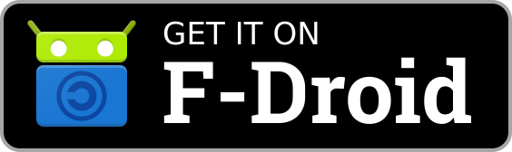
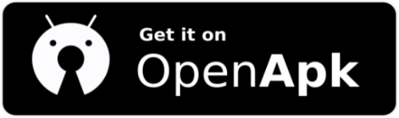
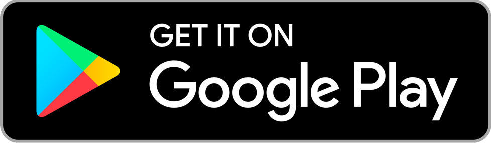
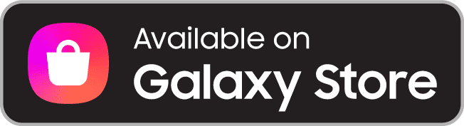
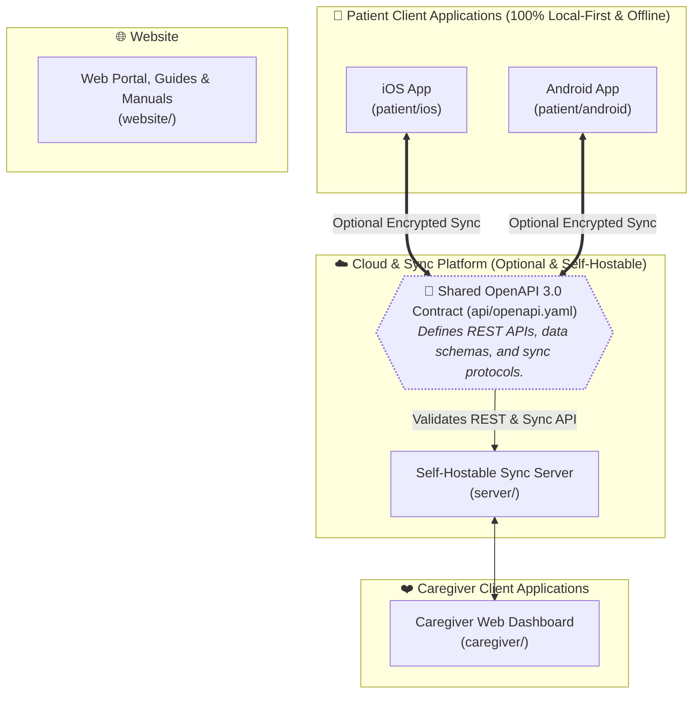

<h1 align="center">
  <a href="https://github.com/saad2134/dosezy">
    
 </a>
</h1>

> <p align="center">🚨 <strong> A smart medicine tracking app that is free, open source, offline and private by default with coming soon, optional Caregiver Cloud Platform for analytics, multi-device sync and family sharing. Dosezy transforms medication management into a simple, stress-free experience. Built with accessibility at its core, the app features clear, large text and intuitive navigation: perfect for elderly users and anyone managing multiple prescriptions.</strong></p>  


<div align="center">


</div>

## 🛍️ Download Now 

### 💊 Patient App (Free, Open-source, Offline & Private by Default)

<div align="center">
  <a href="https://f-droid.org/en/packages/com.saad2134.dosezy">
    
  </a>
  <a href="https://github.com/saad2134/dosezy/releases"> 
     
  </a>
  
  <a> </a>
  <details>
    <summary>Others</summary>
    <br>
    <a href="https://appteka.store/app/com.saad2134.dosezy">
      
    </a>
    <a href="https://www.openapk.net/dosezy/com.saad2134.dosezy/">
      
    </a>
  </details>
</div>


#### Coming Soon On

<div align="center">
  <a href="https://play.google.com/store/apps/details?id=com.saad2134.dosezy">
    
  </a>
  <!-- 
  <a href="">
    
  </a>
  <a href="">
    
  </a> -->
</div>

### 🩺 Caregiver Cloud Platform (Optional, Self-Hostable, Coming Soon)

- coming soon

## ✨ Features  

### 💊 Patient App (Free, Open-Source, Offline & 100% Private)

Dosezy transforms daily medication management into a stress-free experience. Input your medicines, dosages, and schedules, and Dosezy handles the rest—with large, high-contrast visuals, reliable alarms, and total privacy.

- 🔔 **Critical Full-Screen Alarms** – High-visibility alarm screen rings reliably even when your phone is in deep sleep or silent mode. Intercept with physical volume keys to instantly silence audio, or snooze safely with a back gesture.
- 🎵 **Custom Sounds & Dynamic Snooze** – Choose from gentle built-in alert tones or your own device ringtones with in-app audio previews, dedicated alarm volume controls, and customizable snooze intervals (5, 10, 15, 20, or 30 minutes).
- 📦 **Pill Inventory & Low-Stock Warnings** – Real-time stock tracking with automatic deduction on intake. Configurable low-stock alerts notify you well before running out of essential medications.
- 🛒 **Dosezy Pharmacy Refill Order** – Instantly compile formatted prescription refill orders for 15, 30, 60, or 90 days from active inventory or low-stock filters with multi-profile consolidation and smart bottle supply calculations for eye drops. Preview your order with live WhatsApp markdown formatting, then tap to Share via Chat or copy to clipboard.
- 🕒 **Manually Record Dose Time** – Easily record the actual time you took medications when logging doses later to maintain accurate adherence histories.
- 🌐 **Crossing Time Zones (Doses Shift With You)** – Traveling across time zones? Dosezy automatically keeps your reminders anchored to your local daily routine without time distortion.
- ↩️ **Instant Intake Undo** – Made a mistake? Reverse accidental dose logging immediately using the 5-second action snackbar or the persistent Undo button on dose cards, automatically returning deducted tablets to stock.
- 📝 **Clinical Dose Skipping** – Safely pause doses with required clinical explanations (*Doctor advised pause*, *Adverse reaction*, *Fasting*, *Illness*, *Ran out of medicine*) without penalizing your adherence streak.
- 🕒 **12-First Grid Time Picker** – Visual, tremor-friendly grid time selector that places 12 at the top for natural morning/night scheduling, avoiding frustrating circular clock dials.
- 📅 **Interactive Schedule Calendar** – Day, week, and month calendar views with color-coded compliance dots (taken, late, missed, skipped) and full TalkBack screen reader accessibility for visually impaired users.
- 📊 **Adherence Analytics & Compliance Scores** – Multi-ring progress tracking across Today, 7 Days, 30 Days, 90 Days, and All-Time, plus individual medication compliance rates to keep you and your doctor informed.
- 🔍 **Real-Time Medicine Search** – Rapidly find and filter prescriptions in large medicine rosters by name or instruction with instant empty-state guidance.
- 👥 **Multi-Family Profiles** – Manage medications for parents, children, or partners on one device. Each profile keeps separate medicines, schedules, stock counts, and emergency contacts with safe deletion guards.
- 📄 **Doctor PDF Reports & Data Exports** – Generate clean, print-ready adherence summary reports for medical appointments, or export JSON backups and CSV spreadsheets anytime.
- 🔒 **Full Encrypted ZIP Backups & Selective Restore** – Export complete encrypted archives. Restore individual profiles with intelligent conflict resolution (Merge Data, Overwrite, or Create New Profile).
- 🚨 **Emergency Services & Personal Contacts** – 1-tap dialing for national emergency numbers across 10 regions (auto-detected via SIM/locale), plus dedicated personal doctor and family emergency contacts per profile.
- 🎨 **Accessibility & Visual Customization** – Large touch targets, presbyopia-safe 7.8:1 high-contrast typography, 8 customizable pill shapes, 10 palette colors, and adaptive System Dark/Light themes.
- 🌐 **12 Native Languages** – Fully translated across all screens, notifications, alarms, and settings in English, Spanish, Hindi, Chinese, Portuguese, Arabic, French, German, Japanese, Russian, Italian, and Bengali.
- 🛡️ **Notification Reliability Shield** – Built-in diagnostic assistant that checks exact alarm permissions and battery optimization, providing 1-tap device setup guides (Samsung, Xiaomi, OnePlus, etc.) so alarms never fail.
- 🔒 **100% Private & Offline** – No account creation, no sign-ups, and no internet permissions. All health data is encrypted and stays strictly on your phone.  

### 🩺 Caregiver Cloud Platform (Optional, Self-Hostable, Coming Soon)

- coming soon

---

## ⚙️ Platforms

### Patient App

<table border="1" cellpadding="10" cellspacing="0">
  <thead>
    <tr>
      <th>Platform</th>
      <th>Min Version</th>
      <th>Supported?</th>
    </tr>
  </thead>
  <tbody>
    <tr>
      <td>Android</td>
      <td>v7.0 or later</td>
      <td>✅</td>
    </tr>
    <tr>
      <td>iOS</td>
      <td>Coming Soon</td>
      <td>⏳</td>
    </tr>
  </tbody>
</table>


## 🛠️ Tech Stack

### Patient App (Android)

- Language: Kotlin
- UI Framework: Jetpack Compose
- Build System: Gradle (Kotlin DSL)
- Storage & Data: Room Database, DataStore, SharedPreferences, File-based storage

### Caregiver Cloud Platform (Self-Hostable, Coming Soon)

- coming soon


## 🚀 Getting Started (Working on Source Code)

### Patient App (Android)
  1. Fork the repo.
  2. Download & Install Android Studio
  3. Enable Git Version Control & Clone the Repo
  4. Navigate to `/patient/android`
  4. Wait for gradle to initialize
  5. Enjoy.


## 🏛️ Core Philosophy & Product Architecture

Dosezy is architected as an **open-source, local-first monorepo** with an optional connected cloud layer:

> **"Dosezy Cloud enhances Dosezy, never holds Dosezy hostage."**



- **Local-First by Default:** All fundamental features—scheduling, persistent notifications, history tracking, data exports, and emergency services—operate completely offline without requiring an account or network connectivity.
- **Server-Agnostic Sync:** The app supports both the official hosted service (`cloud.dosezy.app`) and Self-Hostable community servers (`server/`).
- **Contract-Driven Development:** Client apps (`patient/android`, `patient/ios`, `caregiver/`) conform to a shared OpenAPI specification (`api/openapi.yaml`), ensuring consistent data models and seamless interoperability.


## 📁 Monorepo Architecture

```
dosezy/
├── .github/                  # CI/CD workflows, build pipelines, and repository automation
├── api/                      # OpenAPI 3.0 contract (openapi.yaml) defining shared client/server schemas
├── caregiver/                # Caregiver companion application & web dashboard (app.dosezy.com)
├── docs/                     # Architecture Decision Records (ADRs), domain specifications, and guides
│   ├── architecture/         # Data layer, sync protocols, and encryption designs
│   ├── privacy/              # Data safety declarations and health privacy compliance
│   └── product/              # Product specs, wireframes, and accessibility requirements
├── patient/                  # Patient application modules
│   ├── android/              # Native Android patient app (Jetpack Compose & Kotlin)
│   │   ├── app/              # Source code, UI components, Room DB, and background services
│   │   ├── assets/           # App branding artwork and density icons
│   │   ├── fastlane/         # F-Droid & store metadata and localized changelogs
│   │   ├── gradle/           # Build wrappers and version catalogs
│   │   └── ui/               # Interactive prototyping templates and wireframes
│   └── ios/                  # (Roadmap) Native iOS patient app (SwiftUI & Swift)
├── resources/                # Offline user documentation, FAQs, and support manuals
│   ├── FAQs.md
│   └── UserManual.md
├── scripts/                  # Code generation, release packaging, and translation sync automation
├── server/                   # Open-source self-hostable sync server (PostgreSQL + REST API)
├── website/                  # Next.js marketing and landing page web app (React 19 & Tailwind CSS v4)
├── CONTRIBUTING.md           # Contribution guidelines and coding standards
├── LICENSE                   # Open-source MIT License
└── README.md                 # Master project documentation
```

## 🗺️ Product Roadmap

<table border="1" cellpadding="10" cellspacing="0">
  <thead>
    <tr>
      <th>Phase / Version</th>
      <th>Milestone</th>
      <th>Focus Areas</th>
      <th>Key Deliverables</th>
      <th align="center">Status</th>
    </tr>
  </thead>
  <tbody>
    <tr>
      <td><strong>v1.0 – v2.3</strong></td>
      <td><strong>Local-First Android Client</strong></td>
      <td>Core Medication Adherence</td>
      <td>Jetpack Compose UI, 12 native localizations, Room offline database, customizable late/missed thresholds, full-screen alarms, emergency dialer, zero account barrier.</td>
      <td align="center">🟢 Released</td>
    </tr>
    <tr>
      <td><strong>v2.5</strong></td>
      <td><strong>Domain & API Contract</strong></td>
      <td>Schema & Boundary Decoupling</td>
      <td>Canonical domain models (<code>Medication</code>, <code>Schedule</code>, <code>DoseEvent</code>), <code>api/openapi.yaml</code> OpenAPI 3.0 specification, multi-platform client generation.</td>
      <td align="center">🟡 In Design</td>
    </tr>
    <tr>
      <td><strong>v3.0 – v3.9</strong></td>
      <td><strong>Self-Hostable Backend & Caregiver Platform</strong></td>
      <td>Incremental Sync & Web Portal</td>
      <td>Open-source server (<code>server/</code>), PostgreSQL DB, conflict-free sync engine, offline mutation queues, optional cloud connection, dedicated Caregiver web portal (<code>caregiver/</code> at <code>app.dosezy.com</code>), remote adherence monitoring, patient-controlled granular sharing permissions.</td>
      <td align="center">⏳ Planned</td>
    </tr>
    <tr>
      <td><strong>v4.0</strong></td>
      <td><strong>Native iOS Patient Client</strong></td>
      <td>Multi-Platform Expansion</td>
      <td>Native Swift & SwiftUI app (<code>patient/ios/</code>), SwiftData/CoreData local database, Apple UserNotifications, zero-account local operation.</td>
      <td align="center">⏳ Planned</td>
    </tr>
  </tbody>
</table>


## 📱 Screenshots

### Patient App

<table> 

<tr> 
<td>
<strong>Home Screen</strong><br><br> 
</td> 
<td>
<strong>Schedule Screen</strong><br><br> 
</td>
<td>
<strong>Medicines Screen</strong><br><br> 
</td>
</tr> 
<tr> 
<td>
<strong>Add New Medicine Screen</strong><br><br> 
</td> 
<td>
<strong>Menu List Screen</strong><br><br> 
</td>
<td>
<strong>Notification Status Dialog</strong><br><br> 
</td>
</tr> 

<tr> 
<td>
<strong>Profile Actions Dialog</strong><br><br> 
</td> 
<td>
<strong>Data Export Feature</strong><br><br> 
</td>
<td>
<strong>Preferences Setting</strong><br><br> 
</td>
</tr> 

</table>

---

## 📊 **Project Stats**

<div align="center">
  


</div>

## 🖼️ App Icon 


## 🔰 Banner


---

## ☕ Support Dosezy

Dosezy is 100% free, open-source, and private with zero ads or telemetry. If Dosezy helps you or your family stay healthy, consider supporting ongoing development:
- **GitHub Sponsors**: [Sponsor @saad2134](https://github.com/sponsors/saad2134)
- **Buy Me a Coffee**: [buymeacoffee.com/saad2134](https://buymeacoffee.com/saad2134)
- In-app crypto wallet options (BTC, ETH, SOL, LTC, ZEC) are also available under **Menu > About Dosezy**.

---

## 📄 License

This project is licensed under the **MIT License** - see the [LICENSE](LICENSE) file for details.

- ✅ Commercial use
- ✅ Modification
- ✅ Distribution
- ✅ Private use
- ❌ Liability
- ❌ Warranty

---

## 👤 Publisher

Developed and published by **Saad (@saad2134)**.

---

## ✍️ Endnote

<p align="center">⭐ Star this repo if you found it helpful! Thanks for reading.</p>

---

## 🏷 Tags  

`android` `ios` `swiftui` `jetpack-compose` `kotlin` `open-source` `local-first` `offline-first` `medicine-reminder` `medicine-management` `medication-adherence` `caregiver` `elderly-care` `health-tech` `self-hosted` `dosezy` `nextjs`

---

## 📃 Changelogs

For full release notes, version history, and detailed changes, please see the [Documentation Changelogs](docs/changelogs/) or [GitHub Releases](https://github.com/saad2134/dosezy/releases).
