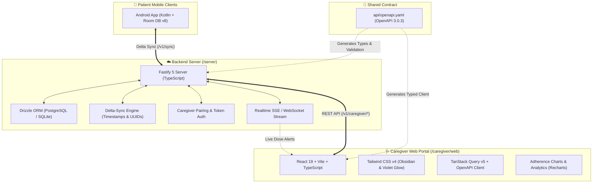

# 📋 Dosezy Cloud & Caregiver Web Platform Implementation Plan

This document outlines the architectural design and multi-phase implementation plan for building the **Dosezy Self-Hostable Backend Server** (`/server`) and the **Caregiver Web Dashboard** (`/caregiver/web`), maintaining strict alignment with the [api/openapi.yaml](../api/openapi.yaml) specification and [website/DESIGN.md](../website/DESIGN.md) design system.

---

## 🎯 Architecture & System Overview



---

## 👥 Architecture & Design Principles

> [!IMPORTANT]
> **Database Dialect Strategy**: **Drizzle ORM** configured with dual support: **SQLite** (default for zero-configuration local development and low-resource homelabs/single-container Docker) and **PostgreSQL** (production deployment for `api.dosezy.app`).
> 
> **Authentication & Privacy by Design**: In adherence with Dosezy's zero-bloat, privacy-first ethos, patient-to-caregiver pairing will utilize temporary 6-character cryptographically secure pairing codes generated on the patient device and redeemed by the caregiver, avoiding mandatory third-party SSO trackers.

---

## 🏗️ Phase-by-Phase Implementation

### Phase 1: Shared Tooling & OpenAPI Code Generation (`/scripts` & Root)

Establish automated schema validation and TypeScript type generation pipelines between `api/openapi.yaml`, the backend server, and the web frontend.

#### [NEW] `scripts/generate-api-types.mjs`
- Automated script using `openapi-typescript` to extract TypeScript interfaces directly from `api/openapi.yaml` and distribute them to `/server/src/types/api.ts` and `/caregiver/web/src/api/types.ts`.

---

### Phase 2: Backend Sync Server (`/server`)

Implement a high-performance, contract-compliant Fastify backend with Drizzle ORM, delta sync algorithms, and caregiver pairing mechanics.

#### 1. Configuration & Dependencies
- **Runtime**: Node.js >=22 LTS, TypeScript, `tsx` for hot-reload dev.
- **HTTP Engine**: Fastify 5 (`@fastify/cors`, `@fastify/websocket`, `@fastify/swagger`, `@fastify/jwt`).
- **ORM & Database**: Drizzle ORM (`drizzle-orm`, `drizzle-kit`, `better-sqlite3`, `pg`).

#### 2. File Structure & Components
```
server/
├── Dockerfile
├── docker-compose.yml
├── package.json
├── tsconfig.json
├── drizzle.config.ts
└── src/
    ├── index.ts                     # Fastify entrypoint & plugin registration
    ├── config/                      # Environment variables & runtime config
    ├── db/
    │   ├── schema.ts                # Drizzle tables (Users, Medicines, Schedules, Caregivers, Pairings)
    │   ├── index.ts                 # Database client (SQLite / PG adapter)
    │   └── migrations/              # Auto-generated SQL migrations
    ├── types/                       # OpenAPI-generated TypeScript interfaces
    ├── routes/
    │   ├── health.ts                # GET /health
    │   ├── users.ts                 # /v1/users CRUD
    │   ├── medicines.ts             # /v1/medicines CRUD
    │   ├── schedules.ts             # /v1/users/{userId}/schedules & dose logging
    │   ├── sync.ts                  # POST /v1/sync (Delta-Sync Protocol)
    │   └── caregiver.ts             # /v1/caregiver/pair & /v1/caregiver/patients
    ├── services/
    │   ├── syncService.ts           # Conflict resolution & incremental delta queries
    │   ├── pairingService.ts        # Pairing code lifecycle & token issuance
    │   └── realtimeService.ts       # SSE / WebSocket broadcast engine
    └── utils/
        └── errors.ts                # Standardized OpenAPI error handlers
```

#### Key Endpoints & Modules:
- **`GET /health`**: Returns system uptime, database connectivity status, and version.
- **`POST /v1/sync`**: Delta-sync handler supporting `lastSyncedAt` filtering, entity upserts with client-generated UUIDs, soft-deletes, and conflict resolution (latest timestamp wins).
- **`POST /v1/caregiver/pair`**: Code generation and redemption engine linking caregiver sessions to patient IDs.
- **`GET /v1/caregiver/patients`**: Computes real-time adherence rates, today's dose summary (Pending, Taken, Late, Missed), and emergency information (allergies/conditions).
- **`GET /v1/caregiver/events`**: Server-Sent Events (SSE) stream for live updates when doses are logged or missed.

---

### Phase 3: Caregiver Web Dashboard (`/caregiver/web`)

Build a responsive, modern web application matching Dosezy's obsidian/violet design language for monitoring patient health and medication compliance.

#### 1. Configuration & Dependencies
- **Framework**: React 19 + Vite + TypeScript.
- **Styling**: Tailwind CSS v4 with `@tailwindcss/vite` matching `website/DESIGN.md`.
- **State & Data Fetching**: TanStack Query v5 (React Query) with optimistic UI updates.
- **Icons & UI Primitives**: Lucide React + Radix UI primitives (`@radix-ui/react-dialog`, `@radix-ui/react-dropdown-menu`, `@radix-ui/react-tabs`).
- **Data Visualization**: Recharts for weekly/monthly adherence heatmaps and compliance trends.

#### 2. File Structure & Components
```
caregiver/web/
├── index.html
├── package.json
├── tsconfig.json
├── vite.config.ts
└── src/
    ├── main.tsx                     # React root with QueryClientProvider
    ├── App.tsx                      # App router & layout container
    ├── index.css                    # Tailwind CSS v4 + @theme Obsidian tokens
    ├── api/
    │   ├── client.ts                # Configured Axios / Fetch client with auth interceptors
    │   ├── types.ts                 # OpenAPI-generated TypeScript interfaces
    │   └── hooks.ts                 # TanStack Query custom hooks (usePatients, useDoseLogs, useSync)
    ├── hooks/
    │   └── useRealtimeEvents.ts     # SSE connection hook for live status updates
    ├── components/
    │   ├── layout/
    │   │   ├── Navbar.tsx           # Brand header, active patient selector, sync status indicator
    │   │   └── Sidebar.tsx          # Navigation (Overview, Timeline, Prescriptions, Analytics, Emergency)
    │   ├── dashboard/
    │   │   ├── AdherenceCard.tsx    # High-visibility daily adherence score circle & streak counters
    │   │   ├── StatusBadge.tsx      # Taken On Time (Green), Taken Late (Amber), Missed (Red), Pending (Cyan)
    │   │   ├── DoseTimeline.tsx     # Today's interactive dose schedule card stack
    │   │   └── QuickRefillAlert.tsx # Medication stock & refill warnings
    │   ├── patient/
    │   │   ├── PatientPairModal.tsx # 6-digit pairing code entry modal
    │   │   ├── MedicalAlerts.tsx    # Known allergies & chronic conditions preview
    │   │   └── MedicineCard.tsx     # Pill visualizer (Vector pill shapes & colors matching Android v2.4.0)
    │   └── analytics/
    │       ├── AdherenceChart.tsx   # Recharts compliance trend & hourly breakdown
    │       └── ExportReportModal.tsx # Doctor report generator & CSV/PDF exporter
    └── pages/
        ├── DashboardPage.tsx        # Central live monitor
        ├── PatientDetailPage.tsx    # In-depth patient view & full prescription schedule
        ├── AnalyticsPage.tsx        # Historical trends, missed dose analytics
        └── SettingsPage.tsx         # Notification preferences & server endpoint settings
```

#### Key UI/UX Highlights:
- **Obsidian Glassmorphic Aesthetic**: Deep `#030407` background, glowing purple/violet borders, semi-transparent frosted cards (`backdrop-blur-md`).
- **Live Status Badges**: Immediate visual alerts when a patient takes or misses medication.
- **Accessibility & Contrast**: Large text, clear typography (`Outfit` headers + `Inter` body), and color-coded status pills.

---

### Phase 4: Self-Hosting & Deployment Orchestration

Provide Docker and Compose configurations enabling single-command deployment for homelab users and cloud maintainers.

#### [NEW] `docker-compose.yml`
- Multi-container orchestration:
  1. `dosezy-server`: Fastify API server with automated SQLite volume or Postgres connection.
  2. `dosezy-caregiver-web`: Nginx-served static build of Caregiver Web SPA with API proxying.
  3. *(Optional)* `postgres`: PostgreSQL 16 database for multi-user cloud instances.

---

## 🧪 Verification & Testing Plan

### 1. Server Automated & Integration Tests
* Run unit tests for database queries and schema migrations:
  ```bash
  cd server && npm test
  ```
* Validate OpenAPI route compliance:
  ```bash
  npx @redocly/cli lint api/openapi.yaml
  ```
* Test delta-sync endpoint with mock payloads:
  ```bash
  curl -X POST http://localhost:8080/v1/sync -H "Content-Type: application/json" -d "..."
  ```

### 2. Caregiver Web Dashboard Verification
* Build verification & lint check:
  ```bash
  cd caregiver/web && npm run build
  ```
* Test real-time pairing and live dose updates:
  1. Generate pairing code on mock/patient client.
  2. Redeem code in Caregiver Web and verify patient cards populate immediately.
  3. Log a "Taken on Time" and "Taken Late" dose action on server, verify Caregiver Web updates badge in real time via SSE without page reload.
  4. Test responsive layout on mobile, tablet, and desktop viewports.

---

## 🚀 Execution Order

1. **Phase 1**: Setup OpenAPI TypeScript generation script.
2. **Phase 2**: Scaffold and implement `/server` (Fastify + Drizzle ORM + Delta Sync + Caregiver routes).
3. **Phase 3**: Scaffold and implement `/caregiver/web` (React 19 + Vite + Tailwind CSS v4 + Dashboard components).
4. **Phase 4**: Setup Docker & Docker Compose deployment configuration.
5. **Phase 5**: Full end-to-end integration test & documentation update.
