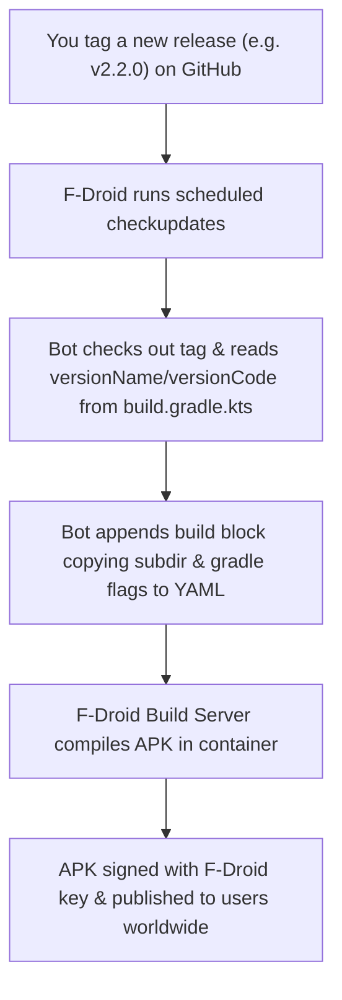

# F-Droid Metadata Structure & Automated Migration Guide

This document outlines the F-Droid metadata configuration, how future automated updates work, and the one-time migration step needed when changing the repository root structure.

---

## 1. Current F-Droid Metadata Configuration

The metadata file for Dosezy in `fdroiddata` (`metadata/com.saad2134.dosezy.yml`):

```yaml
Categories:
  - Health Manager
License: MIT
AuthorName: Saad
AuthorEmail: reach.saad@outlook.com
SourceCode: https://github.com/saad2134/dosezy
IssueTracker: https://github.com/saad2134/dosezy/issues
Donate: https://buymeacoffee.com/saad1inc
Bitcoin: bc1q9r3qll0ya5wznvmdqz7wgdn7xy5dwmy5g23l6q
Litecoin: LZfi2pYxnx23DLSdigeg6Hy8BDVbTDcppE

AutoName: Dosezy

RepoType: git
Repo: https://github.com/saad2134/dosezy.git

Builds:
  - versionName: 1.3.5
    versionCode: 6
    commit: dfefa957e06ff4f0ff64db83d4803383d4aa1fa1
    subdir: app
    gradle:
      - yes

  - versionName: 2.1.0
    versionCode: 13
    commit: 4a045b9203dbd5e2647ce478f5160d5d1ffade0e
    subdir: app
    gradle:
      - yes

AutoUpdateMode: Version
UpdateCheckMode: Tags
CurrentVersion: 2.1.0
CurrentVersionCode: 13
```

---

## 2. Moving Code to `/patient/android`: How it Affects F-Droid

### A. Current Status (v2.1.0)
- The existing release entries (`v1.3.5` and `v2.1.0`) must keep `subdir: app` because in their respective git commits (`dfefa95...` and `4a045b9...`), the Android code is located at `app/`.
- No changes to the YML file are needed right now for the initial listing merge request.

### B. Future Release (e.g. v2.2.0 with the new `/patient/android` structure)
When you tag and release the first version with the new folder structure:

1. **One-Time `subdir` Adjustment:**
   Update `subdir` in the metadata file to point to `patient/android/app`:
   ```yaml
     - versionName: 2.2.0
       versionCode: 14
       commit: <v2.2.0-commit-hash>
       subdir: patient/android/app
       gradle:
         - yes
   ```
2. **Subsequent Releases (`v2.3.0`, `v2.4.0`, etc.):**
   Once set for `v2.2.0`, the automated F-Droid bot will inherit `subdir: patient/android/app` automatically for all future releases without requiring any manual intervention.

---

## 3. How the F-Droid Auto-Update Bot Works



1. **Routine Polling:** The F-Droid server runs `fdroid checkupdates` on a recurring schedule.
2. **Tag Matching:** It scans `https://github.com/saad2134/dosezy.git` for tags matching `v*` and reads `versionName` and `versionCode`.
3. **Automated Commit:** The bot appends a new build block under `Builds:` and increments `CurrentVersion`/`CurrentVersionCode` in `fdroiddata`.
4. **Stable Builds:** Because `isMinifyEnabled = false` and `isShrinkResources = false` are committed in `build.gradle.kts`, the builder container will never run out of memory during `packageRelease`.
