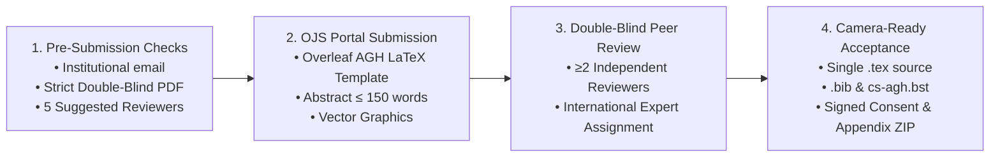

# 🏛️ Journal Submission Requirements & Guidelines
**Journal:** *Computer Science* (AGH University of Krakow Press, Poland)  
**ISSN:** 1508-2806 | **e-ISSN:** 2300-7036  
**Website:** [https://journals.agh.edu.pl/cys](https://journals.agh.edu.pl/cys) | **Contact:** `csci@agh.edu.pl`  
**Indexing:** Scopus (Q3), Web of Science Core Collection (ESCI, Impact Factor = 0.3), DOAJ, DBLP  
**Publication Fee:** **$0 / ₹0 (100% Free, Non-profit, No Article Processing Charges / APC)**  
**Publishing Model:** Continuous publication (as of 2025)

---

## 📌 Executive Summary & Key Milestones

---

## 1. 🏛️ Author Eligibility & Affiliations
* **Institutional Affiliation Mandatory:** Papers are accepted **only** from authors affiliated with recognized scientific institutions (Universities, Research Institutes, Academic Departments).
* **No Generic Emails:** Submissions using personal email providers (`@gmail.com`, `@yahoo.com`, `@outlook.com`, etc.) will be **desk-rejected outright**. Always register and submit using institutional addresses (e.g., `@methodist.edu.in`).

---

## 2. 🕵️ Double-Blind Peer Review & Anonymization
The journal operates a rigorous **double-blind peer-review** model:
* **Strictly Anonymize PDF for Review:** The initial submitted PDF must have **all author names, email addresses, affiliations, and institutional acknowledgements completely removed**.
* **Clean Metadata & Links:** Anonymize code repository links, self-citations (use "Anonymous Authors" or 3rd person), and file metadata.
* **Camera-Ready Inclusion:** Author identities and institutional affiliations are only restored after official acceptance during the camera-ready production stage.

---

## 3. 👥 Reviewer Pool Mandate (5 Suggested Reviewers)
To streamline peer review, authors **must** provide a list of at least **5 suggested independent expert reviewers** meeting all the following criteria:
1. **Domain Expertise:** High scientific competence in mobile health, HCI, software engineering, or distributed/local-first systems.
2. **No Conflict of Interest (COI):** No recent co-authorship or direct supervisory connection with any manuscript author.
3. **Institutional Diversity:** None of the suggested reviewers may belong to the same institution as the authors.
4. **Geographical Diversity:** At least one (preferably most) reviewers must be affiliated with institutions outside the authors' country of origin.
5. **Willingness:** Believed to be active and willing to undertake academic peer reviews.

---

## 4. 📄 Manuscript Formatting & LaTeX Requirements
* **Official Template Only:** Submissions must use the official AGH LaTeX style (`csagh.sty`, `cs-agh.bst`). It is strongly recommended to compile via the official Overleaf template. Submissions in non-LaTeX formats (e.g., raw DOCX) will be desk-rejected.
* **Abstract Length:** Strictly **150 words or fewer**.
* **Single Source File Rule:** The entire LaTeX body must reside in a **single `.tex` file** (do **not** use `\input` or `\include` sub-files).
* **Package Minimality:** Use standard LaTeX packages; keep custom or non-standard packages to an absolute minimum.
* **Bibliography & Citations:** 
  * Formatted using BibTeX with `cs-agh.bst`.
  * Validate `.bib` integrity with JabRef or Zotero (zero BibTeX compilation warnings/errors).
  * Explicitly cite prior publications using full journal naming standards.

---

## 5. 🎨 Figures & Graphics Standards
* **Vector Graphics Preferred:** Diagrams, schematics, and charts must be vector-based (`.pdf` or `.eps`) generated at high fidelity (Inkscape, TikZ, CorelDraw, LibreOffice Draw).
* **Bitmap Resolution (if unavoidable):**
  * Color images: Minimum **300 DPI**, CMYK color space, no lossy compression.
  * Grayscale / Black & white images: Minimum **600 DPI**.

---

## 6. ⚖️ Research Integrity & Ethical Policies
* **Anti-Plagiarism & Ghostwriting:** Strict anti-plagiarism screening. Ghostwriting and honorary "guest authorship" are strictly prohibited and subject to institutional reporting and a 1-year publication ban.
* **AI & LLM Policy:** Generative AI / Large Language Models may **only** be used for language polishing and grammatical proofreading. Papers containing AI-generated scientific content or hallucinated references will be **rejected outright**.

---

## 7. 📦 Post-Acceptance / Camera-Ready Deliverables
Upon manuscript acceptance, authors must supply a single `.zip` archive containing:
1. Compiled camera-ready PDF (with restored author details and affiliations).
2. The single master `.tex` source file.
3. Complete `.bib` bibliography and `cs-agh.bst` file.
4. All vector graphics assets (`.pdf` / `.eps`).
5. Filled, signed, and scanned **Consent to Publish** form.
6. Completed **Appendix** document.

---

## 📋 Pre-Submission Readiness Checklist

| Requirement | Description | Status |
| :--- | :--- | :---: |
| **Institutional Email** | Registered on OJS with `@institution` domain | ⚠️ Crucial |
| **Double-Blind PDF** | No author names, emails, affiliations, or repo user tags | ⚠️ Crucial |
| **Abstract Limit** | Word count &le; 150 words (Dosezy draft = 138 words) | ✅ Ready |
| **LaTeX Single File** | `dosezy_agh_submission_anonymous.tex` standalone (no `\input`) | ✅ Ready |
| **Vector Graphics** | Architecture & state machine diagrams in vector `.pdf` | ✅ Ready |
| **5 Reviewers List** | Complete international reviewer pool prepared in `Suggested_Reviewers.md` | ✅ Ready |
| **No-APC Verification** | Verified 100% free open-access indexing (Scopus Q3 / WoS ESCI) | ✅ Ready |
