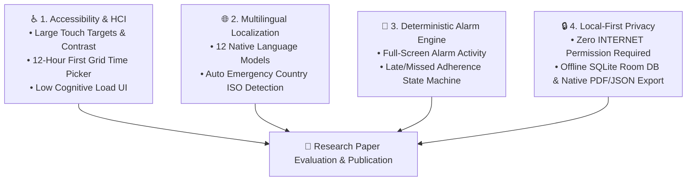

# 🔬 Research Paper Plan: Dosezy Platform

> **Proposed Title:** *Dosezy: An Accessibility-First Mobile Platform for Medication Adherence and Tracking Among Elderly Users*  
> **Repository:** [saad2134/dosezy](https://github.com/saad2134/dosezy)  
> **Target Budget:** ₹0 – ₹5,000 (No-APC / Open Access Legitimate Peer-Reviewed Journals)  
> **Domain Focus:** Health Informatics, Mobile Computing, Accessibility (HCI), Software Engineering

---

## 1. 📌 Executive Summary & Research Value

Dosezy provides an ideal software foundation for an academic research publication in **Human-Computer Interaction (HCI)** and **Digital Health Informatics**. 

Rather than presenting Dosezy merely as a "mobile app project," the research paper frames Dosezy as an **experimentally evaluated, accessibility-first mobile framework** designed to overcome the primary failure modes of existing medication reminder systems: **high complexity for elderly users**, **unreliable notification engines**, **language barriers**, and **privacy risks associated with cloud telemetry**.

---

## 2. 🏛️ Core Research Pillars & Innovations



### A. Human-Computer Interaction (HCI) & Accessibility
- **12-Hour First Grid Time Picker:** Replaces confusing 24-hour sliders and native wheels with direct, large-target time grid selectors tailored for elderly motor control.
- **High-Contrast & Adaptive Dark/Light Mode:** Designed for low-vision and senior users with zero white-flash transitions.

### B. Reliable Alarm & Adherence State Machine
- **Deterministic Alarm Execution:** Utilizes `AlarmManager` with full-screen `AlarmActivity` overrides and notification shade synchronization.
- **Configurable Thresholds:** Custom **Consider Late After** (1–3h) and **Consider Missed After** (3–9h) logic with dynamic status badges (`Xh Xm ago`).

### C. Local-First Privacy & Zero Telemetry
- **Zero Network Dependency:** Operates completely offline with zero `INTERNET` permission required in base client.
- **Native Medical Data Exporters:** Generates printable A4 PDF medical reports and structured JSON backup archives locally.

---

## 3. 🧪 Evaluation Methodology & Benchmarks

To transform the codebase into a publication-worthy paper, the study conducts three empirical evaluations:

1. **System Usability Scale (SUS) Testing:**
   - Benchmark with 15–20 participants (focusing on elderly adults 60+).
   - Evaluate task completion rate (adding a medicine, responding to a reminder, exporting PDF summary).
2. **Notification Reliability & Battery Drain Benchmarks:**
   - Measure alarm trigger accuracy across OEM Android distributions (Stock, MIUI, Samsung One UI) under battery optimization modes.
3. **Localization Accuracy & Emergency Dialer Performance:**
   - Test automatic SIM/network country ISO detection and dialer launcher performance.

---

## 4. 📚 Target No-APC (Zero Publication Fee) Journals

For a budget of **₹0 – ₹5,000**, we target legitimate, DOAJ-indexed computer science and software engineering journals that charge **₹0 Article Processing Charges (No-APC)**:

| Journal Name | Focus Area | Fee (APC) | Indexing | Review Time |
| :--- | :--- | :--- | :--- | :--- |
| **e-Informatica Software Engineering Journal** | Software Engineering & Architecture | **₹0 (No-APC)** | DOAJ, Scopus | ~8–12 weeks |
| **Computer Science** (AGH University) | Computer Science & Mobile Systems | **₹0 (No-APC)** | DOAJ, Scopus | ~6–10 weeks |
| **Journal of Internet and Software Engineering** | Software Systems & HCI | **₹0 (No-APC)** | DOAJ | ~4–8 weeks |
| **IEEE Conference Route (Alternative)** | Mobile Computing / IPRECON | ₹6,999 (Student) | IEEE Xplore, Scopus | ~4–6 weeks |

---

## 5. 🚀 Publication Roadmap

```
Phase 1: Code Baseline & Architecture Lockdown (Completed v2.2.2)
   └── Room DB, PDF Export, 12 Languages, Emergency ISO, Offline Security

Phase 2: Manuscript Draft Preparation (research/Manuscript_Outline.md)
   └── Abstract, Introduction, System Architecture, UI/UX Design

Phase 3: Empirical Data Collection & Usability Study
   └── System Usability Scale (SUS) scores, Notification timing benchmarks

Phase 4: Submission to No-APC Journal
   └── Peer review, revisions, and final publication (₹0 Cost)
```
