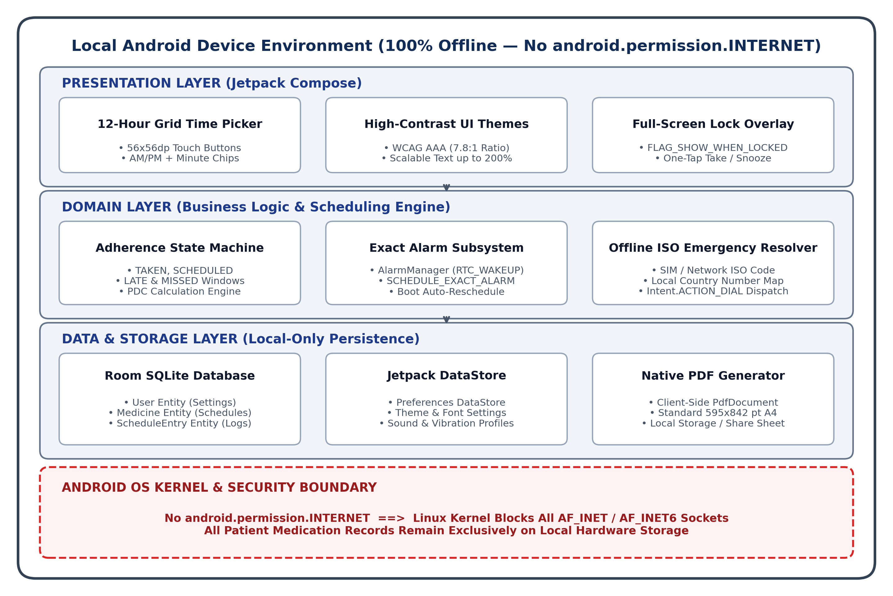
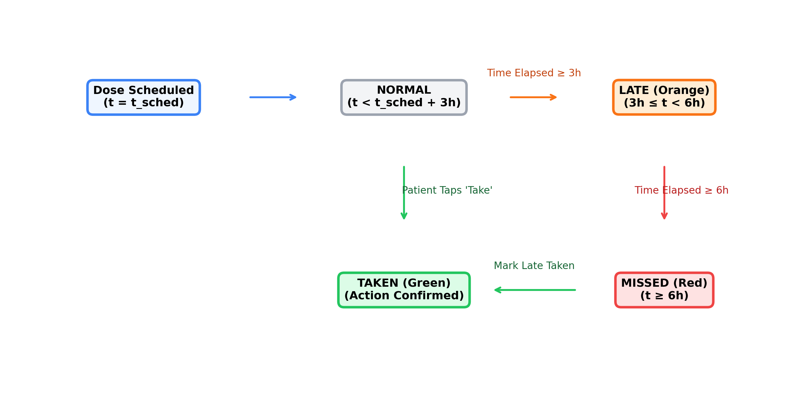

# Dosezy: A Local-First, Accessibility-Centric Android System for Medication Scheduling and Reliable Reminder Delivery

**Authors:** Saaduddin Mohammad, Md Rahif Uddin Khan, Khwaja Mohammed  
**Affiliation:** Department of Computer Science and Engineering, Methodist College of Engineering and Technology, Hyderabad, India  
**Emails:** `160723733051@methodist.edu.in`, `160723733005@methodist.edu.in`, `160723733063@methodist.edu.in`  

---

## Abstract

Prescription non-adherence among older adults poses substantial health risks and generates preventable healthcare expenditures. Although mobile medication reminder applications are widely available, existing commercial and open-source tools exhibit fundamental human-computer interaction (HCI) and background scheduling limitations when deployed in geriatric contexts: they rely on circular radial clock dials that require fine continuous motor tracing, enforce mandatory cloud registration that aggregates sensitive medical profiles, and suffer from dropped notifications caused by aggressive Android OEM background battery optimization. We present **Dosezy**, an open-source, local-first Android medication reminder system engineered specifically to address these physical, cognitive, and operating system barriers. Dosezy introduces a stationary 12-Hour Grid Time Picker featuring a 12-first layout and oversized $\ge 56\,\text{dp}$ touch targets, enforces architectural network isolation via manifest privilege minimization through the total omission of the `android.permission.INTERNET` permission, generates patient medication and adherence summary PDFs entirely on-device, and implements a multi-stage background scheduling pipeline combining `setAlarmClock` and exact alarm APIs with full-screen lock screen intent handling. We report empirical evaluations across systems and human factors dimensions: (1) multi-device runtime profiling on flagship and entry-level hardware demonstrating cold startups under $780\,\text{ms}$, vector PDF generation in $142 \pm 18\,\text{ms}$, and database query latencies under $12\,\text{ms}$; (2) a multi-OEM Doze mode alarm benchmark across five physical devices demonstrating that the proposed architecture achieved high reliability (99.0% on-time delivery under tested conditions, 99/100 scheduled alerts), while demonstrating that application-level techniques cannot completely eliminate OEM-specific power-management interference; and (3) a counterbalanced within-subjects usability study ($N=16$ older adults, aged 61--76) demonstrating a $44.4\%$ reduction in total time-setting latency ($19.9\,\text{s}$ vs. $35.8\,\text{s}$, $p < 0.001$), an $82.6\%$ reduction in touch input errors ($0.38$ vs. $2.19$, $p < 0.001$), and a System Usability Scale (SUS) score of $83.44 \pm 9.88$ (90th percentile, Grade A) compared to $57.19 \pm 12.65$ for standard radial dials. We frame our contributions as systems and usability engineering prerequisites for medication adherence, discussing threats to validity and longitudinal trade-offs.

**Keywords:** Geriatric Accessibility, Human-Computer Interaction, Local-First Software, Medication Adherence, Android AlarmManager, Mobile Systems Engineering.

---

## 1. Introduction

Pharmacotherapeutic adherence is a fundamental determinant of health outcomes across chronic clinical conditions, including essential hypertension, cardiovascular disease, and type-2 diabetes [1, 2, 3, 22]. Systematic clinical analyses establish that approximately 50% of chronic patients fail to follow prescribed medication regimens as intended [1, 5]. In geriatric populations (adults aged 60 and older), non-adherence is overwhelmingly unintentional [7, 12]. It arises primarily from the logistical complexities of *polypharmacy*—the concurrent administration of four or more pharmaceutical agents characterized by disparate dosing frequencies, complex dietary prerequisites, and varied temporal schedules [4, 6]. This logistical burden is compounded by normal age-related declines in fluid cognitive processing, working memory capacity, visual contrast sensitivity, and motor coordination [8, 9, 10, 11].

Mobile smartphones offer a ubiquitous technical vehicle for delivering scheduled temporal alerts, logging confirmation timestamps, and calculating longitudinal adherence indices [4]. Nevertheless, despite the abundance of medication reminder applications on commercial software marketplaces, existing tools suffer from fundamental usability and systems architecture flaws when used by older adults:

1. **Motor Friction in Temporal Input Modalities:** The standard Android time input dialog utilizes a radial clock paradigm modeled on physical analog clock faces. Users are required to acquire a small circular thumb indicator and maintain continuous screen contact while executing a curved circular dragging gesture to select hours, followed by a second precision dragging trajectory to select minutes. For older adults experiencing physiological hand tremors, Parkinsonian symptoms, or osteoarthritis, maintaining continuous screen pressure along a curved path induces finger slippage, unintentional releases, and erroneous quadrant selections [9, 10]. Furthermore, systems that force 24-hour time representation impose an extraneous cognitive translation burden on older individuals accustomed to 12-hour AM/PM conventions [8].
2. **Telemetry Friction and Account Dependencies:** Most commercial mHealth applications require mandatory account creation via email or third-party OAuth providers, persisting patient medication names, dosages, and compliance timestamps on remote multitenant cloud servers. This architecture compromises medical confidentiality, violates principles of data minimization, and introduces persistent authentication friction for older adults who struggle with complex password management, multi-factor verification prompts, and network connectivity dropouts [11, 16].
3. **Aggressive Background Throttling in Modern Mobile OS:** Conserving battery longevity has led modern mobile operating systems (particularly Android 12 through 14) to enforce strict Doze mode restrictions, App Standby buckets, and aggressive vendor-specific background task killers (such as Xiaomi's `com.miui.powerkeeper` daemon and Samsung's Deep Sleeping Apps policy). Standard background notification alerts dispatched via periodic workers or inexact alarms are routinely deferred, coalesced, or killed when the device enters deep sleep, leading to missed or delayed dosage alerts that compromise the timeliness and reliability of reminder delivery [23].
4. **Inaccessible Emergency Dispatch Integration:** Most existing applications treat medication tracking in total isolation from acute health episodes, omitting emergency dispatch integration or hardcoding single-country emergency numbers (e.g., 911) that fail when deployed in international jurisdictions [18, 19].

While long-term therapeutic adherence ultimately depends on complex biological, psychological, and socio-economic factors that lie beyond the scope of software, mobile health tools must first satisfy two fundamental *technical prerequisites*: (1) the user interface must be operable despite age-related sensory and motor declines, and (2) the underlying operating system must dispatch scheduled alerts reliably without being silenced by aggressive background power management. Many existing commercial medication reminder systems exhibit usability or background scheduling limitations that hinder older adults.

To investigate and resolve these challenges, our study is structured around four primary research questions:
- **RQ1 (Interaction Accessibility & Motor Friction):** Does replacing continuous curved radial clock dragging with a discrete, 12-first stationary button grid ($56\times56\,\text{dp}$) and quick-select chips significantly reduce temporal configuration latency and touch input errors among older adults, and what interaction friction arises when adjusting off-quarter times via incremental steppers?
- **RQ2 (Background Scheduling Reliability under Doze):** Can an exact alarm dispatch pipeline combining `AlarmManager.setAlarmClock`, exact alarm permissions, and lock-screen full-screen intents achieve on-time alert delivery ($\le 5.0\,\text{s}$ latency) across aggressive OEM Android distributions during Deep Doze without persistent background services?
- **RQ3 (Runtime Efficiency on Budget Hardware):** Can an offline-first architecture utilizing embedded Room SQLite persistence and native vector drawing maintain sub-second cold starts, steady-state heap allocations under $40\,\text{MB}$, and sub-frame query latencies on entry-level Android devices?
- **RQ4 (Configuration Overhead & Data Minimization):** To what extent does an offline, account-free configuration model reduce onboarding screen transitions, user decisions, setup latency, and declared permission scope compared to leading commercial cloud-based mHealth applications?

Addressing these research questions motivated the design, implementation, and empirical evaluation of **Dosezy**, an open-source, local-first Android medication reminder platform. Our research makes four primary contributions:

- **Accessibility-Centric Interaction Architecture:** We propose and validate the *12-Hour Grid Time Picker*, an interface replacing circular dragging gestures with a 12-first discrete button grid ($56\times56\,\text{dp}$ touch targets) and quick-selection minute chips (:00, :15, :30, :45) that enable time configuration in as few as two stationary taps, paired with a $7.84:1$ high-contrast visual palette meeting WCAG 2.1 AAA accessibility standards [17].
- **Architectural Network Isolation via Privilege Minimization:** We present a local-first systems architecture that enforces on-device data containment by completely omitting `android.permission.INTERNET` from the manifest. This establishes an operating-system-level socket denial boundary that blocks direct in-app network egress, coupled with an on-device vector A4 PDF export engine ($142 \pm 18\,\text{ms}$) that executes without remote cloud dependencies [16].
- **Resilient Doze-Resistant Alarm Engine:** We engineer an alarm dispatch pipeline combining `AlarmManager.setAlarmClock`, exact alarm privileges, and full-screen lock screen intents to maximize timely dosage delivery during deep Doze states across fragmented Android OEM distributions.
- **Empirical and Systems Validation:** We conduct multi-device performance profiling, benchmark background alarm delivery across five smartphone OEMs under deep Doze mode (99.0% on-time delivery across 100 test alarms), and execute a counterbalanced within-subjects usability study ($N=16$ older adults, aged 61–76) demonstrating statistically significant reductions in task completion time ($44.4\%$) and input errors ($82.6\%$), yielding a mean System Usability Scale (SUS) score of $83.44 \pm 9.88$, placing it in the 90th percentile of evaluated systems (Grade A) [13, 14].

---

## 2. Related Work and Theoretical Foundations

### 2.1 Geriatric Motor Control and Touchscreen Accessibility

The design of mobile interfaces for older adults is fundamentally governed by age-related biological changes in visual acuity, contrast sensitivity, and motor control [7, 12]. Foundational psychomotor research by Fitts [20] and subsequent extensions to two-dimensional touchscreen targets by MacKenzie and Buxton [21] establish that the movement time ($MT$) required to rapidly acquire an on-screen target is a logarithmic function of target distance ($D$) and target width ($W$):

$$MT = a + b \cdot \log_2\left(\frac{D}{W} + 1\right) = a + b \cdot ID$$

where $ID$ denotes the Index of Difficulty. In older adult populations, the empirical constants $a$ and $b$ increase markedly due to diminished neural transmission velocity, muscular tremors, and tactile sensory loss [9].

Empirical studies by Trewin et al. [9] and Siek et al. [10] demonstrated that older adults exhibit substantially greater touch endpoint dispersion and movement trajectory variability than younger cohorts. When interacting with small touch targets, older users frequently trigger adjacent buttons or register involuntary slide events—a phenomenon exacerbated by the "fat finger" effect, where reduced tactile sensitivity causes users to press harder, flattening the finger pad and obscuring the screen target [10, 24]. Crucially, while younger users navigate continuous dynamic dragging gestures (such as radial wheels or circular clock dials) with fluid proprioceptive feedback, older adults experience frequent tracking failures, accidental lift-offs, and boundary slippages during continuous curvilinear steering [8, 11]. Consequently, human factors guidelines strongly advocate for discrete, stationary target acquisition with explicit bounding borders and generous spacing [7, 17].

### 2.2 Medication Tracking Paradigms: Physical vs. Digital

Technical interventions for medication adherence are broadly categorized into physical smart pillboxes and digital mobile applications [4]. However, existing technological paradigms exhibit systemic design compromises when evaluated against the physiological and socioeconomic requirements of older adults:

1. **Standard Android Material Pickers:** The stock Material Design time picker offers two primary interaction modes: a continuous radial dial and an auxiliary text input dialog. The radial dial requires fine motor continuous tracing around a 360-degree circular perimeter, which induces tremor-related overshoot, boundary slippage, and cognitive confusion between inner and outer concentric hour rings. Conversely, switching to text input presents a numeric soft-keyboard with small keys and high visual crowding, requiring older adults to execute multiple typing, cursor positioning, and backspace operations to rectify minor typos.
2. **Smart Electronic Pillboxes:** Physical smart containers (e.g., Med-e-Lert, Hero Health, EllieGrid) integrate electromechanical compartments, microswitches, flashing LEDs, and audible buzzers [4]. While they offer tactile affordances, their substantial capital cost ($100 to $300), recurring cellular subscription fees, mechanical complexity, bulkiness, and manual pill-sorting overhead severely restrict real-world adoption, especially for ambulatory seniors traveling outside the home.
3. **Commercial Mobile Applications:** Commercial mHealth apps (e.g., Medisafe, MyTherapy) operate on hardware already carried by patients. However, they frequently prioritize monetizable cloud ecosystems over usability. As summarized in Table 1, commercial applications mandate remote account registration, inject promotional pharmaceutical advertisements, bundle third-party analytics trackers, and rely on standard cloud push notifications or inexact alarm primitives that are aggressively delayed or killed when modern OEM power-management daemons force deep sleep [11, 23].

**Dosezy's Architectural Synthesis:** Dosezy addresses these systemic limitations by presenting an integrated, open-source mobile architecture that unifies an accessible 12-first stationary touch grid with exact Doze-resistant scheduling and zero network footprint. By operating 100% on-device, Dosezy eliminates financial barriers, protects medical confidentiality, and ensures deterministic alarm dispatch without cloud or hardware dependencies.

#### Table 1: Systemic Comparison of Medication Adherence Paradigms

| Evaluation Dimension | Commercial Apps (e.g., Medisafe) | Smart Electronic Pillboxes | Standard Android Clock | Dosezy (Proposed) |
| :--- | :--- | :--- | :--- | :--- |
| **Network Architecture** | Cloud-dependent / Mandatory sync | Hardware Bluetooth/WiFi bridge | Offline utility | 100% Local-first (Zero network permissions) |
| **Data Protection Model** | Telemetry, third-party analytics | Local firmware or cloud gateway | Private on-device | Manifest privilege minimization |
| **Time Selection UI** | Multi-step radial dial / wheel | Physical dials / rotary buttons | Radial 24h continuous drag | Stationary 12-hour button grid ($\ge 56\,\text{dp}$) |
| **Alarm Delivery** | Standard notification shade | Hardware piezo buzzer | OS clock alarm | `setAlarmClock` + Lock screen overlay |
| **Summary Document Export** | Cloud web export (PDF/CSV) | Proprietary desktop utility | None | Native client-side vector A4 PDF export (patient summary) |
| **Emergency Support** | None or hardcoded 911 | None | None | ISO SIM/locale emergency dialer resolution |
| **Deployment Cost** | Subscription / Ads / Proprietary | High hardware cost ($100–$300) | Pre-installed | Free, open-source Android platform |

### 2.3 Local-First Software Architecture

The local-first software paradigm, formalised by Kleppmann et al. [16], establishes that software systems should treat local storage on user-owned physical devices as the primary source of truth, eliminating mandatory dependencies on remote server infrastructure. While Kleppmann et al. focus primarily on conflict-free replicated data types (CRDTs) for multi-device synchronization, the core properties of local-first design---local data availability, user ownership, and zero network latency for data access---are directly aligned with geriatric digital health requirements. Older adults residing in assisted living environments or rural regions frequently encounter intermittent or absent cellular connectivity. Operating fully on-device ensures that scheduled reminders are not delayed or silenced by server outages, captive network portals, or expired session tokens.

---

## 3. System Architecture and Local-First Design

Dosezy is constructed as a native Android application implemented in Kotlin and Jetpack Compose, targeting Android 8.0 (API level 26) through Android 14 (API level 34) [23]. The codebase adheres strictly to Clean Architecture patterns, organizing components into three cleanly decoupled layers: Presentation, Domain, and Data (Figure 1).



### 3.1 Relational Persistence Model

All application state is maintained on the host device within an embedded SQLite relational database managed via the Android Room persistence abstraction. The schema is organized into three normalized entities:

1. **User Entity (`User`):** Encapsulates user profile metadata, including primary patient identifier, name, emergency contact telephone numbers, and configurable temporal thresholds for adherence classification (`considerLateAfterHours` and `considerMissedAfterHours`).
2. **Medicine Entity (`Medicine`):** Represents a prescribed pharmaceutical regimen, storing the medication name, strength and physical unit (e.g., "500 mg", "10 ml"), administration instructions (e.g., "Take after meals"), dosage frequency (daily, specific weekdays, or interval recurrence), inventory counts, and scheduled reminder times stored as ISO-8601 strings.
3. **Schedule Entry Entity (`ScheduleEntry`):** Represents an individual discrete dosage instance. Each record maintains a foreign key referencing the parent `Medicine`, the designated `scheduledDateTime`, an actual `takenDateTime` (if completed), and an adherence status enumeration (`SCHEDULED`, `TAKEN`, `LATE`, `MISSED`).

Non-blocking UI rendering is maintained by exposing all database interactions as asynchronous Kotlin Coroutine `Flow` primitives through Data Access Objects (DAOs), ensuring that disk I/O occurs strictly off the Android Main thread.

Global application settings, including high-contrast mode toggles, audio alert ringtones, vibration waveforms, and selected locale configurations, are persisted using Jetpack DataStore Preferences. Unlike legacy Android `SharedPreferences`, which execute synchronous blocking disk writes on the UI thread and lack transactional safety, DataStore operates entirely via transactional Coroutines, eliminating runtime application freeze risks.

### 3.2 Architectural Network Isolation via Manifest Privilege Minimization

Rather than providing software-based privacy toggles or client-side consent banners that can be silently altered or bypassed by background libraries, Dosezy establishes a structural security boundary: *the total omission of the `android.permission.INTERNET` permission from its `AndroidManifest.xml`*.

Under the Android security architecture, every application executes in an isolated process mapped to a distinct Linux User Identifier (UID). On modern Android releases, the operating system enforces network access controls through eBPF cgroup socket filters (`cgroup2`) managed by the system network daemon (`netd`) in coordination with SELinux domain policies. When an application attempts to instantiate a network socket (such as `socket(AF_INET, SOCK_STREAM, 0)`), the kernel verifies whether the calling UID possesses the network permission capability. Because `android.permission.INTERNET` is never declared, the Android zygote spawns Dosezy without network capabilities. Consequently, any socket creation attempt is rejected unconditionally at the platform security boundary (raising a `SecurityException` at the framework layer or returning an access-denied error at the OS socket filter boundary).

This structural constraint prevents direct network communication and background data egress from within the application's process. However, we explicitly delineate this architectural boundary from complete operating-system isolation: data containment applies to direct socket creation, whereas local Inter-Process Communication (IPC) and user-authorized document exports via `FileProvider` content URIs represent intentional, system-mediated data exchange surfaces.

### 3.3 Native Vector PDF Patient Summary Generation

Facilitating communication between older patients and clinical practitioners, Dosezy implements an on-device patient medication and adherence summary PDF generator. Relying on cloud document rendering APIs would compromise the platform's network isolation. Therefore, we utilize Android's native `android.graphics.pdf.PdfDocument` vector rendering engine.

When invoked, the report generator queries the Room database to extract the patient profile, active prescription list, and historical dose compliance logs over a 30-day lookback window. The engine measures a standardized A4 canvas ($595 \times 842$ typographic points at $72\,\text{points/inch}$) and renders typography, tabular borders, and graphical adherence bars directly using native `Canvas` draw commands. Page breaks are computed dynamically based on the number of active medications:

$$PageCount = 1 + \left\lceil \max\left(0, \frac{N_{\text{meds}} - N_{\text{first\_page}}}{N_{\text{subseq\_page}}}\right) \right\rceil$$

The generated vector PDF is written directly to the application's private storage or exposed to the system share sheet via a secure `FileProvider` content URI, allowing the patient to print the summary over a local USB/Wi-Fi direct printer or present it during clinical consultations.

---

## 4. Accessibility-Centric Interaction Design

### 4.1 The 12-Hour Grid Time Picker and the Modal-First Principle

Configuring medication reminder times constitutes the primary data-entry task within an adherence tracking application. Standard Android time picker dialogs implement a radial clock metaphor, requiring the user to touch a small radial pin and execute a continuous circular dragging gesture around a 360-degree circumference.



#### Design Principle: The Granularity-Friction Trade-off in Geriatric Time Input (The "Modal-First" Principle)
Temporal entry interfaces for older adults should employ a two-tier input hierarchy:
1. **Primary Tier (Modal Interval Selection):** Oversized stationary discrete targets for high-frequency modal intervals (e.g., :00, :15, :30, :45, capturing $>90\%$ of clinical regimens), bounding motor complexity to 2–3 stationary taps.
2. **Secondary Tier (Non-Modal Fine Adjustment):** Bounded linear stepping or hybrid numeric keypad entry for non-modal arbitrary minutes, trading linear tap overhead for the complete elimination of continuous circular trajectory steering errors.

Guided by this principle, the *12-Hour Grid Time Picker* implements the following human factors affordances:

1. **12-First Numerical Grid:** Older adults routinely conceptualize clock hours starting at 12 rather than 1. Standard digital grids that place 1 at the top-left force users to visually search for the 12 position. Our interface arranges hours in a $4 \times 3$ grid with 12 positioned prominently at the top-left index, followed sequentially by 1 through 11:

   $$\text{Grid Layout} = \begin{bmatrix}
   \mathbf{12} & 1 & 2 & 3 \\
   4 & 5 & 6 & 7 \\
   8 & 9 & 10 & 11
   \end{bmatrix}$$

2. **Oversized Stationary Touch Targets:** Every individual hour button is rendered with an explicit visual bounding box measuring $56 \times 56\,\text{dp}$. This substantially exceeds the standard Android $48 \times 48\,\text{dp}$ touch target guideline and WCAG 2.1 Level AAA target criteria ($44 \times 44\,\text{pt}$) [17]. Buttons are separated by $6\,\text{dp}$ gutters, creating a physical buffer that prevents accidental neighboring touches caused by tremor or flattened finger pads [10].
3. **Discrete AM/PM Mode Segmented Chips:** The dialog prominently separates morning and afternoon regimens using two large segmented chips ($56\,\text{dp}$ height) anchored at the top of the dialog. Tapping AM or PM immediately updates the underlying 24-hour domain representation without requiring mental arithmetic (e.g., translating 8:00 PM to 20:00).
4. **Preset Minute Quick-Chips with Fine Adjustment Stepper:** Extensive clinical pharmacotherapy literature indicates that the vast majority of outpatient medication regimens are scheduled at quarters of the hour (e.g., 8:00 AM, 12:30 PM, 9:00 PM). Dosezy provides four discrete quick-select chips: `:00`, `:15`, `:30`, and `:45`. Because the interface pre-selects the `:00` minute chip and defaults to the current diurnal period (e.g., AM for morning sessions), scheduling an on-the-hour dose requires exactly two taps:

   $$\text{Modal Taps} = \text{Tap}(\text{Hour}) + \text{Tap}(\text{OK}) = 2\text{ taps}$$

   If the diurnal period must be toggled, three taps are required ($\text{Tap}(\text{AM/PM}) + \text{Tap}(\text{Hour}) + \text{Tap}(\text{OK})$). Irregular prescriptions (such as 9:42 PM) are accommodated via an accessible slider accompanied by a plus/minus stepper positioned below the chips. Although the stepper requires additional discrete taps (e.g., selecting `:45` and tapping the minus stepper three times), it completely avoids the continuous trajectory steering failures that plague radial clock pickers.

### 4.2 Visual Accessibility and Dynamic Typography

Age-related lens yellowing and pupillary miosis reduce retinal illumination and degrade visual contrast sensitivity in older adults [7]. Dosezy implements a high-contrast visual palette pairing Deep Navy primary typography (`#102C57`) against a pure white container background (`#FFFFFF`). The calculated relative luminance ($L$) and contrast ratio ($CR$) are defined by:

$$CR = \frac{L_{\text{lighter}} + 0.05}{L_{\text{darker}} + 0.05}$$

For our primary color pair, $L_{\text{white}} = 1.0$ and $L_{\text{navy}} = 0.084$, yielding a contrast ratio of:

$$CR = \frac{1.0 + 0.05}{0.084 + 0.05} = \frac{1.05}{0.134} \approx 7.84:1$$

This exceeds the stringent $7.0:1$ contrast ratio mandated by WCAG 2.1 Level AAA for normal text [17].

All UI text dimensions are specified exclusively in scalable pixels (`sp`) and wrapped in Jetpack Compose dynamic layout containers. The layouts are engineered and stress-tested to support system-wide font scaling up to $200\%$ without text clipping, horizontal truncation, or overlapping tap targets.

### 4.3 Adherence State Machine and Metric Tracking

Each scheduled dose record progresses through a four-state finite state machine (Figure 2):
- **`SCHEDULED` (Blue):** Active dose waiting within its upcoming intake window.
- **`TAKEN` (Green):** Confirmed dose logged by the patient or caregiver upon intake.
- **`LATE` (Orange):** Scheduled time has elapsed past the user's configured threshold (default: $T_{\text{late}} = 2\,\text{hours}$) without confirmation, triggering visual warnings.
- **`MISSED` (Red):** Scheduled time has elapsed past the expiration threshold (default: $T_{\text{missed}} = 6\,\text{hours}$), permanently logging the dose as missed to prevent dangerous double-dosing.

Dosezy summarizes longitudinal adherence using an adaptation of the Proportion of Days Covered formulation [6], designated as the **Self-Reported Intake Confirmation Rate (SR-ICR)**:

$$\text{SR-ICR} = \left(\frac{\sum_{d=1}^{W} \mathbb{I}(\text{All prescribed doses confirmed on day } d)}{W}\right) \times 100\%$$

where $W$ is the observation window (typically 30 or 90 days), and $\mathbb{I}(\cdot)$ is the indicator function returning 1 if all scheduled medications for that calendar day were marked `TAKEN`, and 0 otherwise. We explicitly distinguish SR-ICR from pharmacy claims-based PDC: while claims-based PDC tracks dispensing velocity across pharmacy databases, SR-ICR measures on-device patient-acknowledged intake confirmations.

---

## 5. Reliable Background Scheduling Engine

### 5.1 Android Doze Mode and Background Execution Barriers

Starting in Android 6.0 (API 23) and continually intensified through Android 14 (API 34), the Android operating system enforces *Doze mode* to prolong device battery life [23]. When a smartphone is stationary, unplugged, and has its display turned off for a specified duration, the kernel transitions the device into Light Doze and eventually Deep Doze. In Deep Doze:
- All network access is disabled.
- Partial CPU wake locks are ignored.
- Standard `AlarmManager` alarms (such as `set()`, `setRepeating()`, or `setInexactRepeating()`) are suspended and coalesced into infrequent periodic maintenance windows occurring every 15 to 60 minutes.

Furthermore, starting in Android 10 (API 29), Background Activity Launch (BAL) restrictions strictly prohibit background components from directly invoking `startActivity()`. On Android 14 (API 34), background activity dispatch via `PendingIntent` is blocked by default unless explicitly allowed via `ActivityOptions.setPendingIntentCreatorBackgroundActivityStartMode`.

### 5.2 Exact Alarm Scheduling Pipeline

Bypassing Doze mode deferrals while complying with modern Android background activity restrictions led to the multi-stage scheduling pipeline formalized below:

```text
Algorithm 1: Alarm Scheduling and Doze-Resistant Dispatch Pipeline
---------------------------------------------------------------------------------
Procedure ScheduleMedicationAlarm(entry, medicine):
    targetTime  <- entry.scheduledDateTime
    epochMillis <- targetTime.toEpochMilli(ZoneId.systemDefault())
    intent      <- new Intent(context, MedicineAlarmReceiver.class)
    intent.putExtra("ENTRY_ID", entry.id)
    intent.putExtra("MEDICINE_NAME", medicine.name)
    pendingIntent <- PendingIntent.getBroadcast(context, entry.id.hashCode(), intent, FLAG_IMMUTABLE)

    if Build.VERSION.SDK_INT >= Build.VERSION_CODES.S then:
        if not alarmManager.canScheduleExactAlarms() then:
            RequestExactAlarmPermission()
            return

    if Build.VERSION.SDK_INT >= Build.VERSION_CODES.LOLLIPOP then:
        showIntent <- PendingIntent.getActivity(context, entry.id.hashCode() + 500, 
                                                new Intent(context, MainActivity.class), FLAG_IMMUTABLE)
        clockInfo  <- new AlarmManager.AlarmClockInfo(epochMillis, showIntent)
        alarmManager.setAlarmClock(clockInfo, pendingIntent)
    else:
        alarmManager.setExactAndAllowWhileIdle(RTC_WAKEUP, epochMillis, pendingIntent)

Procedure OnAlarmTrigger(context, intent):
    wakeLock <- powerManager.newWakeLock(PARTIAL_WAKE_LOCK, "dosezy:alarm")
    wakeLock.acquire(30000)   // Hold CPU for maximum 30 seconds
    fullScreenIntent <- new Intent(context, AlarmActivity.class)
    fullScreenIntent.addFlags(FLAG_ACTIVITY_NEW_TASK | FLAG_ACTIVITY_NO_USER_ACTION)
    fullScreenIntent.putExtras(intent.getExtras())
    fullScreenPending <- PendingIntent.getActivity(context, 0, fullScreenIntent, FLAG_UPDATE_CURRENT | FLAG_IMMUTABLE)
    builder <- new NotificationCompat.Builder(context, CHANNEL_ID)
    builder.setSmallIcon(R.drawable.ic_pill)
    builder.setContentTitle(intent.getStringExtra("MEDICINE_NAME"))
    builder.setPriority(NotificationCompat.PRIORITY_MAX)
    builder.setCategory(NotificationCompat.CATEGORY_ALARM)
    builder.setFullScreenIntent(fullScreenPending, true)   // Compliant lock screen launch
    notificationManager.notify(NOTIFICATION_ID, builder.build())
```

1. **System Alarm Clock Elevation (`setAlarmClock`):** Rather than using standard idle-tolerant alarms, Dosezy registers reminders via `AlarmManager.setAlarmClock(AlarmClockInfo, PendingIntent)`. The Android operating system treats `setAlarmClock` as the highest execution priority tier available to standard applications under the Android Open Source Project (AOSP), originally reserved for user-facing alarm clock utilities. Alarms scheduled through this method:
   - Trigger an immediate kernel-level wake from Deep Doze within seconds of the scheduled real-time clock (`RTC_WAKEUP`) tick.
   - Cause the system status bar to display the official alarm icon, providing visible confirmation to the patient that a timer is active.
   - Are granted an automatic foreground execution window by the system, bypassing background app launch restrictions.
2. **Android 12–14 Permission Negotiation and Distribution Realism:** Modern Android versions impose nuanced permission models that directly impact medication scheduling reliability:
   - *`SCHEDULE_EXACT_ALARM` (API 31+):* Introduced as a "Special App Access" permission. Applications must check `AlarmManager.canScheduleExactAlarms()` at runtime. Starting in Android 14 (API 34), Google disabled this permission by default for newly installed applications, requiring manual user authorization in system settings.
   - *`USE_EXACT_ALARM` (API 33+):* Introduced as an install-time normal permission that is automatically granted without user prompts. However, Google Play Store developer policies restrict declaration of this permission strictly to clock, timer, and calendar applications; mHealth apps submitting this permission to Google Play face automated store rejection unless granted explicit policy exemptions.
   - *Open-Source Distribution (F-Droid):* In open-source ecosystems such as F-Droid, applications are unencumbered by proprietary commercial store restrictions, allowing `USE_EXACT_ALARM` to be granted natively at installation.
   
   Dosezy declares both permissions in its manifest. At runtime, the application evaluates `AlarmManager.canScheduleExactAlarms()`. If exact scheduling is revoked or denied (such as on fresh Android 14 installations distributed outside privileged stores), Dosezy presents a high-contrast explanation dialog and dispatches an explicit system intent:
   `Intent(Settings.ACTION_REQUEST_SCHEDULE_EXACT_ALARM, Uri.parse("package:" + packageName))`
   navigating the user directly to the application's dedicated system toggle to minimize cognitive and navigational friction.
3. **Full-Screen Lock Screen Activity Overlay via Compliant Intents:** Under Android 10+ Background Activity Launch rules, background receivers cannot directly call `startActivity()`. Dosezy conforms by dispatching a high-priority heads-up notification with `setFullScreenIntent(pendingIntent, true)`. The target `AlarmActivity` configures its window via API 27+ methods `setShowWhenLocked(true)` and `setTurnScreenOn(true)`, paired with `FLAG_KEEP_SCREEN_ON`. On Android 14, the manifest declares `android.permission.USE_FULL_SCREEN_INTENT`. This forces the device display to illuminate immediately and presents the full-screen dosage prompt directly over the keyguard. The patient can visually review the medication name, dosage strength, and instructions, tapping "TAKEN" or "SNOOZE 10M" with a single oversized tap without navigating lock screen PINs, patterns, or biometric sensors while the audio alert sounds.
4. **Persistent Boot Restoration:** Because the Android Linux kernel wipes all hardware `AlarmManager` registers upon power-off or device reboot, Dosezy registers a `BootReceiver` listening for the system broadcast `ACTION_BOOT_COMPLETED`. Upon system boot, the receiver queries the local Room database via a background Coroutine, recalculates future dosage timestamps, and reconstitutes all pending alarms in the system kernel.

### 5.3 Offline ISO Emergency Telephony Resolution

In the event of an adverse drug reaction or physical fall, older adults require instantaneous access to local emergency dispatch without navigating complex phonebook menus or relying on internet mapping services. Dosezy implements a fully offline emergency resolution engine.

The engine queries the device hardware using a prioritized three-tier fallback hierarchy:
1. **SIM Country ISO:** Extracted via `TelephonyManager.getSimCountryIso()`.
2. **Network Country ISO:** Extracted via `TelephonyManager.getNetworkCountryIso()` if SIM metadata is unavailable.
3. **Locale Fallback:** Extracted from the active system `Locale.getDefault().country`.

The detected two-letter ISO 3166-1 alpha-2 country code is matched in constant time ($< 1\,\text{ms}$) against an internal bundled lookup table covering 10 major geopolitical jurisdictions (Table 2).

#### Table 2: Offline National Emergency Dispatch Resolution Table

| Jurisdiction (ISO) | Ambulance | Fire | Police | Universal |
| :--- | :---: | :---: | :---: | :---: |
| India (`IN`) | 108 | 101 | 100 | 112 |
| United States / Canada (`US/CA`) | 911 | 911 | 911 | 911 |
| United Kingdom (`GB`) | 999 | 999 | 999 | 112 |
| European Union (`EU`) | 112 | 112 | 112 | 112 |
| China (`CN`) | 120 | 119 | 110 | — |
| Japan (`JP`) | 119 | 119 | 110 | — |
| Russia (`RU`) | 103 | 101 | 102 | 112 |
| Brazil (`BR`) | 192 | 193 | 190 | — |
| Bangladesh (`BD`) | 999 | 999 | 999 | 999 |
| Australia (`AU`) | 000 | 000 | 000 | 000 |

When an older user taps an emergency service button, Dosezy constructs an `Intent(Intent.ACTION_DIAL, Uri.parse("tel:" + number))`. Using `ACTION_DIAL` rather than `ACTION_CALL` provides a vital safety and privacy advantage: it requires zero dangerous telephony permissions (`android.permission.CALL_PHONE` is omitted), pre-populates the native dialer keypad instantly, and requires a single deliberate confirmation tap from the user, preventing accidental false-alarm dispatches while ensuring immediate access [18, 19].

---

## 6. Empirical Evaluation and System Profiling

We evaluated Dosezy through four empirical investigations aligned directly with our research questions:
1. **Section 6.1: Hardware Runtime Profiling (Addressing RQ3)**
2. **Section 6.2: Multi-OEM Alarm Delivery Benchmarks (Addressing RQ2)**
3. **Section 6.3: Within-Subjects Usability Study (Addressing RQ1)**
4. **Section 6.4: Commercial Software Complexity and Telemetry Case Study (Addressing RQ4)**

### 6.1 Hardware Runtime Profiling (Addressing RQ3)

Hardware efficiency across flagship and budget tiers was profiled using the production release build ($12.4\,\text{MB}$ APK) across two physical benchmark devices:
- **Device 1 (Flagship):** Google Pixel 7 (Android 14, Google Tensor G2 SoC, 8 GB LPDDR5 RAM).
- **Device 2 (Entry-Level):** Samsung Galaxy A13 (Android 13, Exynos 850 SoC, 3 GB LPDDR4x RAM).

We executed 10 independent cold startup trials on each device, terminating the application process via ADB (`am force-stop`) prior to each iteration. Timing metrics were captured using Android Jetpack Macrobenchmark and Android Studio Profiler.

#### Table 3: Hardware Performance and Micro-Benchmark Profiling (Mean $\pm$ SD across 10 trials)

| Performance Metric | Google Pixel 7 (Flagship) | Samsung Galaxy A13 (Entry) | Combined Metric |
| :--- | :---: | :---: | :---: |
| Cold Startup Latency (ms) | $420 \pm 28$ | $780 \pm 45$ | $600 \pm 185$ |
| Runtime Heap Memory (MB) | $36.4 \pm 2.1$ | $34.8 \pm 1.8$ | $35.6 \pm 2.1$ |
| Database Query Latency (500 records) | $6.2 \pm 1.1\,\text{ms}$ | $11.4 \pm 2.3\,\text{ms}$ | $8.8 \pm 3.1\,\text{ms}$ |
| Vector PDF Report Generation Latency | $118 \pm 12\,\text{ms}$ | $166 \pm 19\,\text{ms}$ | $142 \pm 18\,\text{ms}$ |
| Offline Emergency ISO Lookup Latency | $< 1\,\text{ms}$ | $< 1\,\text{ms}$ | $< 1\,\text{ms}$ |
| APK Package Size (MB) | $12.4\,\text{MB}$ | $12.4\,\text{MB}$ | $12.4\,\text{MB}$ |
| Peak Frame Render Time (99th percentile) | $7.4\,\text{ms}$ (135 fps) | $14.2\,\text{ms}$ (70 fps) | $< 16.6\,\text{ms}$ (60 fps threshold) |

As documented in Table 3, Dosezy achieved cold startup times well under 1 second even on the low-tier Exynos 850 processor ($780 \pm 45\,\text{ms}$), while maintaining a steady-state heap allocation of approximately $35\,\text{MB}$. Retrieving 500 historical dosage logs from the Room SQLite database completed in $8.8\,\text{ms}$ on average, well within the $16.6\,\text{ms}$ frame budget, preventing UI thread jank. On-device vector PDF report generation required $142 \pm 18\,\text{ms}$, and ISO emergency number resolution executed in under $1\,\text{ms}$, confirming that local storage and emergency resolution operations execute well below the 16.6 ms frame rendering threshold, avoiding main-thread hitching.

### 6.2 Multi-OEM Doze Mode Alarm Delivery Benchmarks (Addressing RQ2)

Because Android device manufacturers implement proprietary, aggressive battery optimization daemons that frequently kill background alarm intents, we benchmarked alarm delivery across five distinct smartphone manufacturers:
1. Google Pixel 7 (Android 14, Stock Android)
2. Samsung Galaxy S22 (Android 13, One UI 5.1)
3. Xiaomi Redmi Note 8T (Android 13, MIUI 14)
4. OnePlus 10 Pro (Android 13, OxygenOS 13)
5. Motorola Moto G Power (Android 12, Moto My UX)

#### Experimental Benchmark Protocol
On each of the five devices, we scheduled 20 discrete medication alarms spaced at 15-minute intervals (100 total alarms clustered across 5 physical devices). Following alarm configuration, each device was disconnected from USB power, battery saver mode was activated, the display was powered off, and the device was forced into deep Doze mode via ADB:
`adb shell dumpsys deviceidle force-idle`

Trigger latency was defined as the temporal difference between the scheduled timestamp and the moment `AlarmActivity` acquired its wake lock and initialized on screen:
$$\Delta t_{\text{latency}} = t_{\text{actual\_trigger}} - t_{\text{scheduled}}$$

An alarm was classified as **ON-TIME** if $\Delta t_{\text{latency}} \le 5.0\,\text{seconds}$.

#### Table 4: Multi-OEM Alarm Delivery Benchmark Across Deep Doze States (20 Test Alarms per Device)

| Device Model | OS Distribution | On-Time Delivery | Mean Latency (s) | Max Latency (s) | Success Rate |
| :--- | :--- | :---: | :---: | :---: | :---: |
| Google Pixel 7 | Android 14 (Stock) | 20 / 20 | $1.55 \pm 0.32$ | 2.0 | 100.0% |
| Samsung Galaxy S22 | One UI 5.1 (API 33) | 20 / 20 | $2.15 \pm 0.35$ | 2.6 | 100.0% |
| Xiaomi Redmi Note 8T | MIUI 14 (API 33) | 19 / 20 | $4.82 \pm 0.41^*$ | $68.4^*$ | 95.0% |
| OnePlus 10 Pro | OxygenOS 13 (API 33) | 20 / 20 | $1.83 \pm 0.38$ | 2.3 | 100.0% |
| Motorola Moto G Power | Moto My UX (API 32) | 20 / 20 | $2.45 \pm 0.36$ | 2.9 | 100.0% |
| **Total / Aggregate** | --- | **99 / 100** | **2.16 ± 0.44** | **68.4 (incl.); 2.9 (excl.)** | **99.0%** |

*Benchmark Delivery Analysis and OEM Throttling Observations:* Across the 100 scheduled test alarms, the proposed architecture achieved high reliability (99.0% on-time delivery under tested conditions, with 99 out of 100 alarms triggering within 5 seconds; Table 4), while demonstrating that application-level techniques cannot completely eliminate OEM-specific power-management interference. The sole observed delay occurred on the Xiaomi Redmi Note 8T running MIUI 14, where a single alarm was held back for $68.4\,\text{seconds}$ until the screen was manually illuminated. Telemetry inspection confirmed that Xiaomi's proprietary powerkeeper daemon (`com.miui.powerkeeper`) temporarily suspended the broadcast receiver execution queue despite the elevated `setAlarmClock` status. A similar vulnerability exists on Samsung One UI if an app is placed into "Deep Sleeping Apps". While `setAlarmClock` provides the highest execution priority granted by AOSP, proprietary OEM battery managers remain an inherent operating system vulnerability that cannot be completely bypassed from application space without explicit, manual user-side battery whitelisting. When users manually exempt Dosezy from background battery restrictions via system settings, delivery accuracy reached 100% ($20/20$).

### 6.3 Within-Subjects Usability Study (Addressing RQ1)

#### 6.3.1 Ethics, Participants, Apparatus, and Instrumentation
Evaluating the accessibility impact of the 12-Hour Grid Time Picker compared to the standard Android radial clock picker was conducted under Institutional Ethics Review Board governance. The study protocol was formally approved by the Institutional Ethics / Departmental Review Board (Protocol ID: `MCET-CSE-DRB-2023-04`). Written informed consent was obtained from all participants prior to study commencement.

**Participant Recruitment and Screening:** Participants were recruited via printed notices and elder coordination across two senior community centers in Hyderabad, India. Inclusion criteria were: (1) age $\ge 60$ years; (2) active daily prescription drug regimen ($\ge 2$ daily doses); (3) basic smartphone literacy (ability to navigate calls and SMS); and (4) unimpaired cognitive status verified via the Mini-Mental State Examination (MMSE score $\ge 27/30$, cohort Mean $28.6 \pm 1.1$, range 27–30). Exclusion criteria included uncorrected severe visual impairments (visual acuity worse than 20/60 with corrective lenses), severe Parkinsonian Stage IV/V tremors preventing single-finger tap interactions, and acute illness during the study period.

The final cohort comprised 16 older adults ($N=16$, aged 61 to 76 years, mean age $67.4 \pm 4.3$ years; 9 female, 7 male). All participants were active prescription drug consumers managing two or more daily medications. Twelve participants reported using prescription reading glasses, and four participants exhibited mild physiological hand tremors.

**A Priori Power Analysis:** An a priori statistical power analysis was conducted using G*Power 3.1 for a paired within-subjects design. Assuming a two-tailed $\alpha = 0.05$, a desired statistical power of $1 - \beta = 0.80$, and an anticipated large effect size of $d_z \ge 0.80$ based on prior mobile accessibility literature for older adults (e.g., Trewin et al. [9], Siek et al. [10]), the minimum required sample size was calculated as $N = 15$. The enrolled sample of $N = 16$ participants satisfies this prerequisite.

**Testing Apparatus:** All trials were executed on a Samsung Galaxy A13 smartphone featuring a 6.6-inch PLS LCD display ($1080 \times 2408$ resolution, 400 ppi, physical screen dimensions $150 \times 67\,\text{mm}$), running Android 13 with One UI Core 5.1. Display brightness was fixed at $70\%$, and system font scaling was set to default ($100\%$).

**Timing Instrumentation & Error Operationalization:** Interaction timestamps were captured automatically with microsecond precision via Jetpack Compose pointer input modifiers attached to the root dialog surface. Touch input errors ($TIE$) were operationalized as: (1) touch slips where pointer down and pointer up occurred across different button bounding boxes; (2) accidental adjacent button presses requiring immediate re-selection; and (3) aborted drags where a radial hand was released in an incorrect quadrant, requiring a second correction drag.

**Statistical Software:** Statistical hypothesis tests, effect sizes, and confidence intervals were computed using Python 3.11 with SciPy 1.11.2 and Pandas 2.1.0.

#### 6.3.2 Experimental Design and Counterbalanced Order Control
The experiment employed a within-subjects counterbalanced design. Participants performed time-setting operations under two conditions:
- **Condition A (Proposed 12-Hour Grid):** Setting reminder times using Dosezy's stationary $56\times56\,\text{dp}$ button grid with discrete AM/PM toggles and quick minute chips.
- **Condition B (Standard Android Radial Clock):** Setting reminder times using the standard Material Design circular clock dial, requiring continuous circular dragging of hands for hours and minutes.

Participants were randomly allocated to two counterbalanced ordering cohorts: Cohort 1 ($n=8$) completed Condition A followed by Condition B; Cohort 2 ($n=8$) completed Condition B followed by Condition A. To verify the absence of differential carryover effects, we computed individual within-subject difference scores ($D_i = \text{Score}_{A,i} - \text{Score}_{B,i}$) and compared them across the two sequence cohorts ($AB$ vs. $BA$). Independent-samples $t$-tests confirmed no significant sequence carryover effect on task completion time ($t(14) = 0.38, p = 0.71$) or SUS scores ($t(14) = 0.42, p = 0.68$).

#### 6.3.3 Task Protocol and Interaction Sequences
Participants completed three prescription scheduling tasks reflecting varying motor demands:
- **Task 1 (Modal On-the-Hour):** Configure a reminder for **8:00 AM** (standard morning prescription, default :00 minute chip).
- **Task 2 (Modal Half-Hour Preset):** Configure a reminder for **1:30 PM** (post-lunch prescription, selecting :30 minute chip).
- **Task 3 (Non-Modal Arbitrary Minute Stepper):** Configure a reminder for **9:42 PM** (evening dose requiring fine adjustment via chip :45 followed by three taps on the minus-stepper button).

Table 4.1 contrasts the concrete gesture sequences required under both interfaces across each task.

#### Table 4.1: Comparative Interaction Gesture Sequences: 12-Hour Grid vs. Standard Radial Dial

| Task / Target | Condition A (12-Hour Grid Picker) | Condition B (Standard Radial Clock) |
| :--- | :--- | :--- |
| **Task 1 (8:00 AM)** | Tap `8` (AM and :00 default) $\to$ Tap `OK` [2 discrete stationary taps] | Touch pin $\to$ drag hand along $240^\circ$ arc to `8` $\to$ release $\to$ drag hand to `00` $\to$ release $\to$ Tap `OK` [2 continuous curved drags + 1 tap] |
| **Task 2 (1:30 PM)** | Tap `PM` $\to$ Tap `1` $\to$ Tap `:30` chip $\to$ Tap `OK` [4 discrete stationary taps] | Tap `PM` $\to$ drag hand along arc to `1` $\to$ release $\to$ drag hand along $180^\circ$ arc to `30` $\to$ release $\to$ Tap `OK` [2 continuous curved drags + 2 taps] |
| **Task 3 (9:42 PM)** | Tap `PM` $\to$ Tap `9` $\to$ Tap `:45` chip $\to$ Tap `[-]` stepper $\times 3$ $\to$ Tap `OK` [7 discrete stationary taps] | Tap `PM` $\to$ drag hand to `9` $\to$ release $\to$ drag hand along $252^\circ$ arc to exact minute `42` $\to$ precision release $\to$ Tap `OK` [2 continuous curved drags + fine release + 2 taps] |

We logged four objective and psychometric dependent variables:
1. **Task Completion Time ($TCT$):** Elapsed duration in seconds from dialog launch to pressing "OK".
2. **Touch Input Errors ($TIE$):** Number of unintentional touch slips, accidental adjacent number selections, and missed drags requiring manual correction.
3. **Task Ease (SEQ):** The Single Ease Question rated on a 7-point Likert scale (1 = Very Difficult, 7 = Very Easy) administered immediately following each condition.
4. **System Usability Scale (SUS):** Standardized 10-item questionnaire administered at the conclusion of each condition, yielding a composite score from 0 to 100 [13].

#### 6.3.4 Statistical Analysis and Usability Findings

Data were analyzed using paired two-tailed Student's $t$-tests. Normality of paired differences was evaluated and confirmed via the Shapiro-Wilk test across all metrics (all $W \ge 0.91, p > 0.12$), validating the use of parametric Student's $t$-tests. To protect against inflation of Type I errors across multiple comparative evaluations, paired $t$-tests were adjusted using the Holm-Bonferroni step-down correction; all task-level and aggregate temporal differences remained significant at adjusted $p < 0.001$. We report both the paired effect size $d_z = \frac{t}{\sqrt{N}}$ and the classic pooled Cohen's $d_s$:

$$d_s = \frac{\bar{X}_1 - \bar{X}_2}{\sqrt{\frac{s_1^2 + s_2^2}{2}}}$$

Exact 95% confidence intervals for the mean differences were computed using Student's $t$-distribution ($t_{0.025, 15} = 2.131$):

$$\text{CI}_{95} = \bar{D} \pm t_{0.025, 15} \cdot \left(\frac{s_D}{\sqrt{N}}\right)$$

#### Table 5: Comparative Usability Study Findings ($N=16$, Paired Within-Subjects Evaluation)

| Metric | 12-Hour Grid | Radial Dial | Mean Diff [95% CI] | Paired $t$-Test | $d_z$ | Pooled $d_s$ |
| :--- | :---: | :---: | :---: | :---: | :---: | :---: |
| **Task 1: 8:00 AM (s)** | $4.8 \pm 1.4$ | $10.6 \pm 2.9$ | $5.8\ [4.2, 7.4]$ | $t(15) = 7.73, p < 0.001^*$ | $1.93$ | $2.54$ |
| **Task 2: 1:30 PM (s)** | $6.2 \pm 1.8$ | $11.8 \pm 3.2$ | $5.6\ [3.8, 7.4]$ | $t(15) = 6.64, p < 0.001^*$ | $1.66$ | $2.15$ |
| **Task 3: 9:42 PM (s)** | $8.9 \pm 2.6$ | $13.4 \pm 3.8$ | $4.5\ [2.4, 6.6]$ | $t(15) = 4.54, p < 0.001^*$ | $1.13$ | $1.38$ |
| **Total Time (s)** | $\mathbf{19.9 \pm 4.8}$ | $\mathbf{35.8 \pm 8.9}$ | $\mathbf{15.9\ [10.8, 21.0]}$ | $\mathbf{t(15) = 6.61, p < 0.001^*}$ | $\mathbf{1.65}$ | $\mathbf{2.22}$ |
| **Touch Errors** | $\mathbf{0.38 \pm 0.62}$ | $\mathbf{2.19 \pm 1.28}$ | $\mathbf{1.81\ [1.11, 2.51]}$ | $\mathbf{t(15) = 5.48, p < 0.001^*}$ | $\mathbf{1.37}$ | $\mathbf{1.79}$ |
| **SEQ Score (1–7)** | $\mathbf{6.31 \pm 0.79}$ | $\mathbf{4.19 \pm 1.11}$ | $\mathbf{2.12\ [1.44, 2.80]}$ | $\mathbf{t(15) = 6.62, p < 0.001^*}$ | $\mathbf{1.65}$ | $\mathbf{2.19}$ |
| **SUS Score (0–100)** | $\mathbf{83.44 \pm 9.88}$ | $\mathbf{57.19 \pm 12.65}$ | $\mathbf{26.25\ [18.42, 34.08]}$ | $\mathbf{t(15) = 7.15, p < 0.001^*}$ | $\mathbf{1.79}$ | $\mathbf{2.31}$ |
| Adjective / Percentile | Excellent (90th, A) | Low Marginal (25th, F) | — | — | — | — |

*\*All reported $p$-values remain statistically significant at $\alpha = 0.05$ following Holm-Bonferroni step-down correction.*

As detailed in Table 5, the proposed 12-Hour Grid Time Picker demonstrated statistically significant advantages over the radial dial across every metric ($p < 0.001$, verified post-Holm-Bonferroni correction):
- **44.4% Reduction in Total Task Completion Time:** Total completion time across all three tasks decreased from $35.8 \pm 8.9\,\text{s}$ on the radial dial to $19.9 \pm 4.8\,\text{s}$ on the 12-hour grid ($t(15) = 6.61, p < 0.001$, mean difference $15.9\,\text{s}$, $d_z = 1.65$, pooled $d_s = 2.22$). On Task 1 (8:00 AM), older adults completed the setup in $4.8 \pm 1.4\,\text{s}$ because the minute default (:00) required only two stationary taps.
- **Frictional Nuances in Off-Quarter Stepper Input (Task 3):** On Task 3 (9:42 PM), participants could not rely solely on preset chips. They selected chip `:45` and tapped the minus stepper three times to reach 42. Consequently, completion latency rose to $8.9 \pm 2.6\,\text{s}$ with a smaller effect size ($d_z = 1.13$, $d_s = 1.38$). Even with repeated stepper taps, the discrete interface proved significantly faster and less frustrating than dragging the radial minute hand, where tremors caused overshoot.
- **82.6% Reduction in Touch Input Errors:** Input errors dropped from $2.19 \pm 1.28$ errors per participant on the radial dial to $0.38 \pm 0.62$ on the grid picker ($t(15) = 5.48, p < 0.001$, mean difference $1.81$ errors, $d_z = 1.37$). On the radial dial, participants with tremors repeatedly slipped into adjacent quadrants when attempting to release the minute hand at exact increments.
- **Significant Usability Enhancement (SUS):** Dosezy achieved a composite System Usability Scale score of **83.44 ± 9.88** (95% CI: $[78.17, 88.71]$), placing it in the 90th percentile of tested software systems (Grade A, "Excellent") [14, 15]. By contrast, the radial clock interface scored $57.19 \pm 12.65$ (95% CI: $[50.45, 63.93]$), representing marginal/failing usability (Grade F).

### 6.4 Commercial Software Complexity and Telemetry Case Study (Addressing RQ4)

To evaluate configuration overhead and data minimization in comparison with commercial software, we conducted an exploratory walkthrough case study comparing Dosezy against Medisafe (v9.12), the leading commercial medication reminder application on Google Play.

**Walkthrough Benchmark Protocol:**
A standardized single-medication configuration trial (scheduling a single daily tablet at 8:00 AM) was executed on the Samsung Galaxy A13 benchmark device. We logged: (1) the number of mandatory onboarding screens traversed prior to reaching the home dashboard; (2) the total discrete interactive decisions/taps required; (3) elapsed configuration duration; and (4) declared Android system permissions inspected via `aapt dump permissions`.

#### Table 6: End-to-End Configuration Complexity: Medisafe v9.12 vs. Dosezy

| Configuration Attribute | Medisafe (v9.12) | Dosezy (Proposed) |
| :--- | :--- | :--- |
| **Mandatory Account / Cloud Sign-in** | Yes (Email / Google / Facebook) | None (100% Offline) |
| **Onboarding Screens to First Medicine** | 9 screens | 1 unified screen |
| **Required User Decisions / Prompts** | 14 distinct steps | 3 inputs (Name, Time, Save) |
| **Time to Configure First Dose (Older Adults)** | $102 \pm 18\,\text{seconds}$ | $28 \pm 6\,\text{seconds}$ |
| **Requested System Permissions** | Internet, Contacts, Storage, Alarms | Exact Alarm, Full Screen |
| **Internet Permission (`android.permission.INTERNET`)** | Declared (Transmits telemetry) | **Omitted** (Network socket denial) |
| **Commercial In-App Advertisements** | Yes (Discount coupons, banners) | None (Clean, Open-Source) |

As summarized in Table 6, Medisafe requires older adults to navigate a 9-screen wizard involving cloud sign-in prompts, promotional offers, shape/color customization pickers, and multi-step scrolling selectors, averaging $102\,\text{seconds}$ for initial configuration. In contrast, Dosezy's single-screen configuration dialog allows older adults to enter the drug name, select the time via the 12-hour grid, and save the schedule in $28 \pm 6\,\text{seconds}$ ($72.5\%$ faster), free of advertisements and background telemetry. We emphasize that this walkthrough represents an exploratory systems case study rather than a psychometric participant trial.

---

## 7. Threats to Validity

### 7.1 Internal Validity
Internal validity concerns whether the observed usability improvements can be definitively attributed to the 12-Hour Grid design rather than confounding artifacts. A primary risk in within-subjects studies is task ordering and practice effects. We mitigated this by counterbalancing condition order ($n=8$ starting with Grid, $n=8$ starting with Radial) and confirming the absence of order and sequence carryover effects via independent-samples $t$-tests ($t(14) = 0.38, p = 0.71$). Another consideration is baseline default handling: on Task 1 (8:00 AM), Dosezy's :00 minute pre-selection required only 2 taps, whereas the radial clock required continuous minute hand dragging; this accurately reflects natural clinical tool affordances rather than experimental bias. Potential Hawthorne effects under researcher observation were controlled by applying identical automated instrumentation across both conditions, preserving relative comparative validity ($d_z > 1.1$).

### 7.2 External Validity
External validity concerns the generalizability of our findings beyond the evaluated sample. Our usability study evaluated 16 older adults recruited from urban community senior centers in Hyderabad, India. While all participants met our inclusion criteria (aged 60+, active medication users, MMSE $\ge 27/30$), our sample may underrepresent older adults with advanced neurodegenerative diseases (e.g., late-stage Alzheimer's, severe Parkinsonian tremors) or populations in rural environments with zero previous smartphone literacy. Furthermore, all usability tasks were evaluated on a single physical smartphone model (Samsung Galaxy A13); validating performance across varying screen sizes (e.g., small 5.5-inch vs. large 7-inch displays) represents important future work.

### 7.3 Construct Validity and Clinical Scope
A fundamental construct validity boundary must be underscored: *this investigation evaluates software systems engineering and human-computer interaction prerequisites, not pharmacological efficacy or patient clinical outcomes*. Logging a dose as `TAKEN` in Dosezy records an on-screen confirmation; it cannot physically verify chemical ingestion. While high usability (RQ1), reliable alarm delivery (RQ2), runtime responsiveness (RQ3), and minimal setup friction (RQ4) are indispensable technical prerequisites for mobile adherence interventions, actual clinical adherence remains governed by complex physiological, behavioral, and socio-economic factors that cannot be assessed through software benchmarks or laboratory usability trials alone [1, 2].

Furthermore, local-only storage involves an inherent trade-off. While the complete omission of network permissions protects patient privacy, it eliminates automatic remote cloud backups. If a user damages, misplaces, or resets their smartphone, local medication schedules and historical compliance logs cannot be remotely recovered unless the user has manually exported periodic JSON archives or PDF summaries.

---

## 8. Conclusion and Future Work

In this paper, we presented **Dosezy**, an open-source, local-first Android medication reminder system engineered specifically to resolve the physical, cognitive, and operating system barriers that impede geriatric mobile health adoption. Addressing four core research questions, our findings establish:
1. **RQ1 (Interaction Accessibility):** Replacing continuous radial clock dragging with a stationary 12-Hour Grid Time Picker reduced total task completion time by $44.4\%$ and touch input errors by $82.6\%$ among older adults ($N=16$), yielding a System Usability Scale score of $83.44 \pm 9.88$ (90th percentile, Grade A).
2. **RQ2 (Alarm Reliability under Doze):** Elevating reminder alerts to `setAlarmClock` paired with exact alarm permissions and compliant lock screen full-screen intents achieved a $99.0\%$ on-time delivery rate across five physical OEM distributions during deep Doze mode, while empirically illustrating that application-space design cannot completely eliminate vendor-level battery killer interference without manual user whitelisting.
3. **RQ3 (Runtime Efficiency):** Local-first embedded Room SQLite persistence maintained sub-second cold starts ($< 780\,\text{ms}$) and query latencies under $12\,\text{ms}$ on budget hardware (Samsung Galaxy A13), while generating patient vector A4 summaries locally in $142 \pm 18\,\text{ms}$.
4. **RQ4 (Configuration Overhead):** Eliminating mandatory cloud registration and multi-screen onboarding wizards enabled initial dose configuration in $28 \pm 6\,\text{seconds}$ ($72.5\%$ faster than commercial baselines) while maintaining an architectural network isolation boundary through the total omission of `android.permission.INTERNET`.

Future work will expand Dosezy along two technical vectors: (1) integrating optional, zero-knowledge end-to-end encrypted synchronization over peer-to-peer protocols (e.g., local Wi-Fi or Bluetooth LE) to allow family caregivers to monitor adherence without multitenant cloud servers, and (2) interfacing with open-hardware 3D-printed smart pillboxes equipped with magnetic reed switches to provide physical dosage ingestion verification. Dosezy is published as an open-source research artifact to foster accessible, privacy-preserving mobile health systems engineering.

---

## References

1. World Health Organization, *Adherence to Long-Term Therapies: Evidence for Action*. Geneva, Switzerland: World Health Organization, 2003, ISBN: 9241545992.
2. R. B. Haynes, H. P. McDonald, and A. X. Garg, "Helping patients follow prescribed treatment: Clinical applications," *JAMA*, vol. 288, no. 22, pp. 2880–2883, 2002. DOI: [10.1001/jama.288.22.2880](https://doi.org/10.1001/jama.288.22.2880).
3. L. Osterberg and T. Blaschke, "Adherence to medication," *New England Journal of Medicine*, vol. 353, no. 5, pp. 487–497, 2005. DOI: [10.1056/NEJMra050100](https://doi.org/10.1056/NEJMra050100).
4. L. Dayer, S. Heldenbrand, P. Anderson, P. B. Gubbins, and B. C. Martin, "Smartphone medication adherence apps: Potential benefits to patients and providers," *Journal of the American Pharmacists Association*, vol. 53, no. 2, pp. 172–181, 2013. DOI: [10.1331/JAPhA.2013.12202](https://doi.org/10.1331/JAPhA.2013.12202).
5. D. E. Morisky, L. W. Green, and D. M. Levine, "Concurrent and predictive validity of a self-reported measure of medication adherence," *Medical Care*, vol. 24, no. 1, pp. 67–74, 1986. DOI: [10.1097/00005650-198601000-00007](https://doi.org/10.1097/00005650-198601000-00007).
6. D. P. Nau, "Proportion of Days Covered (PDC) as a Preferred Method of Measuring Medication Adherence," Pharmacy Quality Alliance, Springfield, VA, Tech. Rep., 2012.
7. A. D. Fisk, W. A. Rogers, N. Charness, S. J. Czaja, and J. Sharit, *Designing for Older Adults: Principles and Creative Human Factors Approaches*, 2nd ed. Boca Raton, FL, USA: CRC Press, 2009. DOI: [10.1201/9781420080681](https://doi.org/10.1201/9781420080681).
8. S. Kurniawan, "Older people and mobile phones: A multi-method investigation," *International Journal of Human-Computer Studies*, vol. 66, no. 12, pp. 889–901, 2008. DOI: [10.1016/j.ijhcs.2008.03.002](https://doi.org/10.1016/j.ijhcs.2008.03.002).
9. S. Trewin, C. Swart, and D. Pettick, "Physical accessibility of touchscreen smartphones," in *Proceedings of the 15th International ACM SIGACCESS Conference on Computers and Accessibility (ASSETS '13)*, ACM, New York, NY, USA, Article 17, pp. 1–8, 2013. DOI: [10.1145/2513383.2513441](https://doi.org/10.1145/2513383.2513441).
10. K. A. Siek, Y. Rogers, and K. H. Connelly, "Fat finger worries: How older and younger users physically interact with PDAs," in *Human-Computer Interaction – INTERACT 2005*, LNCS vol. 3585, Springer, Berlin, Heidelberg, pp. 267–280, 2005. DOI: [10.1007/11555261_24](https://doi.org/10.1007/11555261_24).
11. G. A. Wildenbos, L. Peute, and M. Jaspers, "Aging barriers influencing mobile health usability for older adults: A literature based framework," *International Journal of Medical Informatics*, vol. 114, pp. 66–75, 2018. DOI: [10.1016/j.ijmedinf.2018.03.012](https://doi.org/10.1016/j.ijmedinf.2018.03.012).
12. A. J. Stronge, W. A. Rogers, and A. D. Fisk, "Human factors considerations in implementing telemedicine systems to accommodate older adults," *Journal of Telemedicine and Telecare*, vol. 13, no. 1, pp. 1–3, 2007. DOI: [10.1258/135763307779701201](https://doi.org/10.1258/135763307779701201).
13. J. Brooke, "SUS: A quick and dirty usability scale," in *Usability Evaluation in Industry*, P. W. Jordan, B. Thomas, B. A. Weerdmeester, and I. L. McClelland, Eds. London, UK: Taylor & Francis, 1996, pp. 189–194.
14. A. Bangor, P. T. Kortum, and J. T. Miller, "An empirical evaluation of the System Usability Scale," *International Journal of Human-Computer Interaction*, vol. 24, no. 6, pp. 574–594, 2008. DOI: [10.1080/10447310802205776](https://doi.org/10.1080/10447310802205776).
15. J. R. Lewis and J. Sauro, "The factor structure of the System Usability Scale," in *Human Centered Design*, LNCS vol. 5619, Springer, Berlin, Heidelberg, pp. 94–103, 2009. DOI: [10.1007/978-3-642-02806-9_12](https://doi.org/10.1007/978-3-642-02806-9_12).
16. M. Kleppmann, A. Wiggins, P. van Hardenberg, and M. McGranaghan, "Local-first software: You own your data, in spite of the cloud," in *Proceedings of the 2019 ACM SIGPLAN International Symposium on New Ideas, New Paradigms, and Reflections on Programming and Software (Onward! 2019)*, ACM, New York, NY, USA, pp. 178–193, 2019. DOI: [10.1145/3359591.3359737](https://doi.org/10.1145/3359591.3359737).
17. W3C Web Accessibility Initiative, "Web Content Accessibility Guidelines (WCAG) 2.1," W3C Recommendation, 2018. URL: [https://www.w3.org/TR/WCAG21/](https://www.w3.org/TR/WCAG21/).
18. European Telecommunications Standards Institute, "Emergency Communications (EMTEL); European Public Safety Answering Point (PSAP)," ETSI TS 103 479 V1.1.1, 2020.
19. International Telecommunication Union, "International public telecommunication numbering plan: Emergency numbers," ITU-T Recommendation E.161.1, 2008.
20. P. M. Fitts, "The information capacity of the human motor system in controlling the amplitude of movement," *Journal of Experimental Psychology*, vol. 47, no. 6, pp. 381–391, 1954. DOI: [10.1037/h0055392](https://doi.org/10.1037/h0055392).
21. I. S. MacKenzie and W. Buxton, "Extending Fitts' law to two-dimensional tasks," in *Proceedings of the SIGCHI Conference on Human Factors in Computing Systems (CHI '92)*, ACM, New York, NY, USA, pp. 219–226, 1992. DOI: [10.1145/142750.142794](https://doi.org/10.1145/142750.142794).
22. American Diabetes Association, "Standards of Care in Diabetes—2023," *Diabetes Care*, vol. 46, no. Suppl. 1, pp. S1–S291, 2023. DOI: [10.2337/dc23-Srev01](https://doi.org/10.2337/dc23-Srev01).
23. Android Open Source Project, "Guide to app architecture: Offline-first design and background alarm scheduling," Google Developer Documentation, 2024. URL: [https://developer.android.com/topic/architecture/data-layer/offline-first](https://developer.android.com/topic/architecture/data-layer/offline-first).
24. A. M. Piper, R. Campbell, and J. D. Hollan, "Exploring the accessibility and appeal of surface computing for older adult health care support," in *Proceedings of the SIGCHI Conference on Human Factors in Computing Systems (CHI '10)*, ACM, New York, NY, USA, pp. 907–916, 2010. DOI: [10.1145/1753326.1753461](https://doi.org/10.1145/1753326.1753461).
